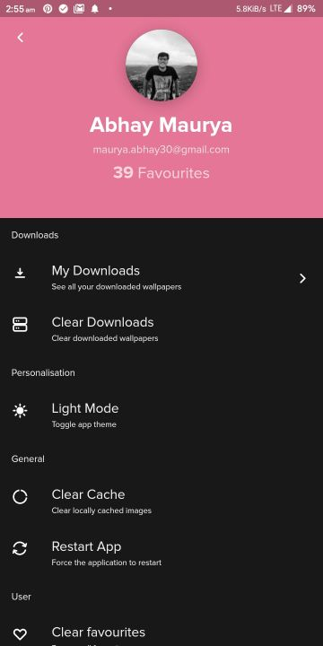
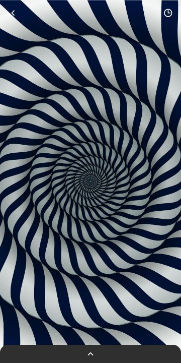
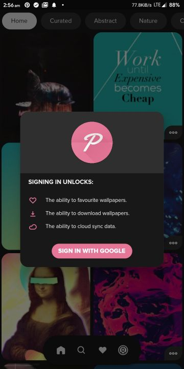
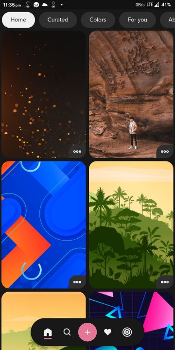
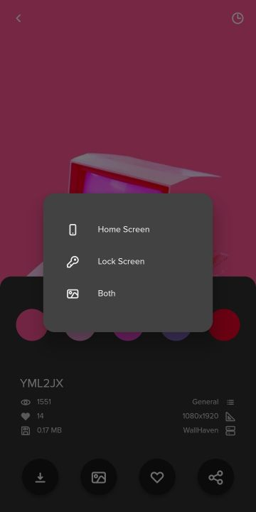
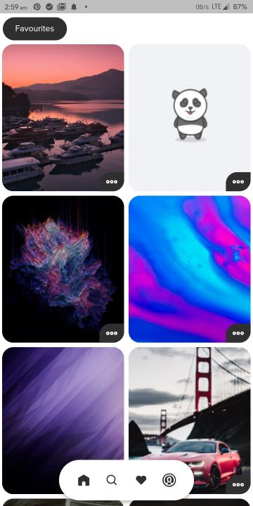
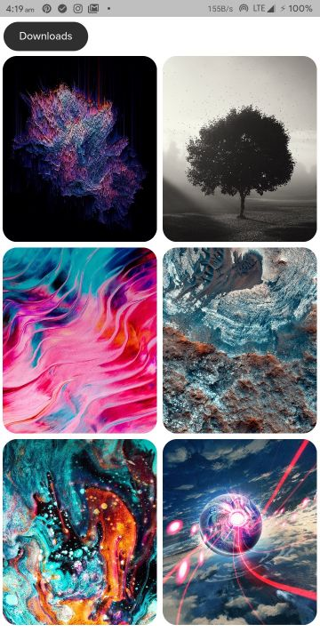
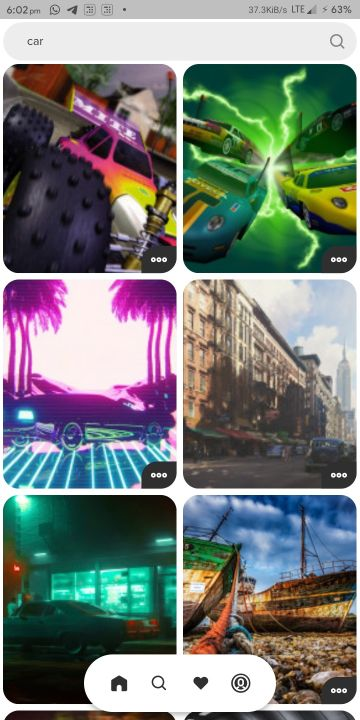
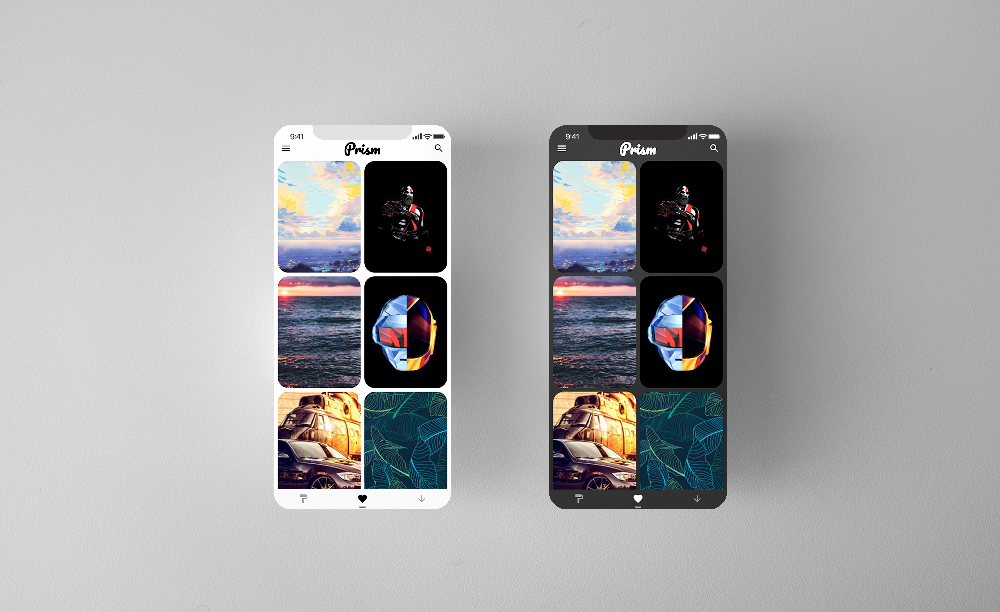

#  Prism

Prism is a beautiful open-source wallpapers app for Android. It is built with Dart on top of Google's Flutter Framework.


<<<<<<< HEAD


Prism relies on [WallHaven](https://wallhaven.cc/help/api) and [Pexels](https://www.pexels.com/api/) API as its source of beautiful and large collection of Wallpapers. By utilising their API, it provides the user with a fast and smooth experience filled with subtle animations and minimal design. The main goal of Prism is to make the smartphone customisation experience, smooth and easy, yet giving the users amazing wallpapers, and features like downloading infinite (as much your storage allows) wallpapers or sharing the ones they like with others.

Prism offers a never-ending feed of wallpapers on its home screen. It also has a Curated section that is filled with the best photos/wallpapers updated everyday. It also features categories like Abstract, Nature if you are into these. Then it allows one to find wallpapers on the basis of colors, i.e. you can find wallpapers with a color that matches your icons or homescreen setup. Not even that, it also shows you a pallete of colors from any wallpaper in the app, on clicking which you can find wallpapers of that specific color.
=======
<a href='https://play.google.com/store/apps/details?id=com.hash.prism&pcampaignid=pcampaignidMKT-Other-global-all-co-prtnr-py-PartBadge-Mar2515-1'></a>

Prism relies on [WallHaven](https://wallhaven.cc/help/api) and [Pexels](https://www.pexels.com/api/) API as its source of beautiful and large collection of Wallpapers. By utilising their API, it provides the user with a fast and smooth experience filled with subtle animations and minimal design. The main goal of Prism is to make the smartphone customisation experience, smooth and easy, yet giving the users amazing wallpapers, and features like downloading infinite (as much your storage allows) wallpapers or sharing the ones they like with others.

Prism offers a never-ending feed of wallpapers on its home screen. It also has a Curated section that is filled with the best photos/wallpapers updated every day. It also features categories like Abstract, Nature if you are into these. Then it allows one to find wallpapers on the basis of colors, i.e. you can find wallpapers with a color that matches your icons or homescreen setup. Not even that, it also shows you a palette of colors from any wallpaper in the app, on clicking which you can find wallpapers of that specific color.
>>>>>>> 3814e7810a3b20078ee5f7e171a84dfc3aca67df

Main features like finding and setting up wallpapers don't rquire Google Sign In, while features like Favourites or Downloads require you to sign up using Google. This signup is facilitated by Google Firebase, so it is secure and we only get your name, email and profile photo for identification purposes. The app also has Dark Mode, if you want to save your phone's battery while getting in love with those wallpapers. The app also allows users to share wallpapers with others by giving them a unique link for every wallpaper, using Dynamic Links so that anyone can directly view the wallpaper.

## List of Contents

1. [Features](#features)
2. [Changelog](#changelog)
3. [Demo](#demo)
<<<<<<< HEAD
4. [Dependencies](#dependencies)
5. [Usage](#usage)
6. [Development](#development)
7. [License](#license)
8. [Contributors](#contributors)
9. [To-Do](#to-do)
=======
4. [Support](#support)
5. [Dependencies](#dependencies)
6. [Usage](#usage)
7. [Development](#development)
8. [License](#license)
9. [Contributors](#contributors)
10. [To-Do](#to-do)
>>>>>>> 3814e7810a3b20078ee5f7e171a84dfc3aca67df

## Features

- High-Quality Wallpapers from [WallHaven](https://wallhaven.cc/help/api) and [Pexels](https://www.pexels.com/api/)
- Dark Mode supported
- Google Sign In is optional
<<<<<<< HEAD
- Low Internet usage due to minimal loading and persistant data using Provider
=======
- Low Internet usage due to minimal loading and persistent data using Provider
>>>>>>> 3814e7810a3b20078ee5f7e171a84dfc3aca67df
- Home Feed is infinite, never ends
- Save Liked Images for later (works even after uninstalling the app)
- Download any wallpaper to Gallery
- Secure data and favourites storage on Google Firebase
- Search for Wallpapers by keyword
- Check how the wallpaper will look with fake clock and app icons
- Search for Wallpapers by color
- Find wallpapers with similar color to one wallpaper
- Set any wallpaper on the home screen, lock screen or both
- Find wallpapers by category (Curated, Abstract and Nature)
- Extensive settings menu with various options
- Toast/Snackbar supported buttons
- Minimal design with smooth transitions
- Clear Cache, Downloads and Favourites with one-tap
- Optimised storage using minimal packages
- Application size under 10 MB
- Adaptive UI (changes colour based on wallpaper)

## Changelog

### v2.3.5
- Major bug fixes and improvements

### v2.3.0
- Changed app icon and splash screen animations
- Added backwards compatibility for v1
- Redesigned profile page UI
- Fixed favourites and downloads

### v2.2.0
- Added clock overlay to test wallpapers
- Added ability to share wallpapers
- Added ability to clear app cache
- Major bug fixes and tweaks

### v2.0.0
- Completely new redesigned UI
- Added Pexels API support
- Added new color based search
- Added new themes
- Added 1M+ wallpapers
- Added non intrusive sign in support
- Added new quick wallpaper actions
- Added new palette generator

### v1.0.0
- Added the app on Play Store
- Wallpapers from WallHaven
- Multiple Themes supported (including dark and light themes)
- Sign in with Google support
- Save Liked Images for later (works even after uninstalling the app)
- Download any wallpaper to Gallery
- Search for Wallpapers by keyword
- Search for Wallpapers by colour
- Set any wallpaper on the home screen, lock screen or both
- Subtle Animations with Flare
- Toast/Snackbar supported buttons
- Clear Cache, Downloads and Favourites with one-tap
- Optimised storage using minimal packages
- Adaptive UI (changes colour based on wallpaper)

## Demo

**Screens**

|  |  |  |  |  |
| :-------------: | :-------------:  | :-------------:  | :-------------:  | :-------------:  |
|     Explore     |    Curated    |    Abstract     |     Nature       |     Color Based     |


<<<<<<< HEAD
|  |  |  |  |  |
=======
|  |  |  |  |  |
>>>>>>> 3814e7810a3b20078ee5f7e171a84dfc3aca67df
| :-------------: | :-------------:  | :-------------:  | :-------------:  | :-------------:  |
|     Color Picker    |    Favourites    |    Downloads     |     Search       |     Profile     |


|  | |        |   | |
| :-------------:  | :-------------: | :-------------:       | :-------------:  | :-------------: |
|  Sign-in Popup    |    Quick Action Menu       |  Wallpaper Display    | Wallpaper Info   | Clock for testing  |

|  |  |  |  |  |
| :-------------: | :-------------:  | :-------------:  | :-------------:  | :-------------:  |
|     Splash Screen    |    Loading Animation    |    Wallpaper Popup     |     Changelog       |     Wallpaper Info 2     |

**Light Theme**

<<<<<<< HEAD
|  | | |  | |
| :-------------:  | :-------------: | :-------------: | :-------------:  | :-------------: |
|  Explore  |Search|  Favourites    |      Downloads   |      Profile  |

=======
|  | | |  | |
| :-------------:  | :-------------: | :-------------: | :-------------:  | :-------------: |
|  Explore  |Search|  Favourites    |      Downloads   |      Profile  |


## Support

If you like what we do, and would want to help us continue doing it, consider sponsoring this project.

<a href="https://www.buymeacoffee.com/HashStudios" target="_blank"></a>

You can also help by downloading the app from Google Play store and reviewing it.

<a href='https://play.google.com/store/apps/details?id=com.hash.prism&pcampaignid=pcampaignidMKT-Other-global-all-co-prtnr-py-PartBadge-Mar2515-1'></a>
>>>>>>> 3814e7810a3b20078ee5f7e171a84dfc3aca67df
## Dependencies

The following packages are needed for the development of this application.

- `provider: ^4.1.3` for caching data, and state management
- `optimized_cached_image: ^0.1.13` for caching wallpapers
- `palette_generator: ^0.2.2` for generating wallpaper colors
- `flutter_colorpicker: ^0.3.4` for color picker dialog
- `fluttertoast: ^4.0.1` for toast notifications
- `gallery_saver: ^2.0.1` for saving wallpapers to gallery
- `shared_preferences: ^0.5.7` for storing settings like theme
- `share: ^0.6.4` for sharing the wallpaper links
- `url_launcher: ^5.4.5` for launching urls
- `cloud_firestore: ^0.13.5` for storing liked images and other user based data
- `firebase_core: ^0.4.4+3` for firebase support
- `firebase_auth: ^0.16.0` for user authentication
- `firebase_dynamic_links: ^0.5.1` for wallpaper link generation and handling
- `google_sign_in: ^4.4.4` for Google sign in support
- `permission_handler: ^5.0.1+1` for handling required device permissions
- `flare_splash_screen: ^3.0.1` for the animated splash screen
- `flutter_svg: 0.17.4` for svg assets

More details about these can be found in the [`pubspec.yaml`](https://github.com/Hash-Studios/Prism/tree/master/pubspec.yaml) file.

## Usage

The application files for Android devices can be found on [Play Store](https://play.google.com/store/apps/details?id=com.hash.prism).

More information about the releases can be found in the [Release](https://github.com/Hash-Studios/Prism/releases) tab.

## Development

Start by forking the repository, and then run `flutter pub get` in the local repository. Then you need to create a Firebase project and add the `google-services.json` file to this app.

You are now ready to modify, fix, update, or remove any feature in the app. If you want, you can create pull requests, we will be happy to welcome them.
>Note: This project requires Flutter Framework to be installed on your machine.

## License

This app is licensed under the [`BSD 3-Clause License`](https://github.com/Hash-Studios/Prism/tree/master/LICENSE.txt).
Any Usage of the source code must follow the below license.

```
BSD 3-Clause License

Copyright (c) 2020 Hash Studios
All rights reserved.

Redistribution and use in source and binary forms, with or without
modification, are permitted provided that the following conditions are met:

1. Redistributions of source code must retain the above copyright notice, this
   list of conditions and the following disclaimer.

2. Redistributions in binary form must reproduce the above copyright notice,
   this list of conditions and the following disclaimer in the documentation
   and/or other materials provided with the distribution.

3. Neither the name of the copyright holder nor the names of its
   contributors may be used to endorse or promote products derived from
   this software without specific prior written permission.

THIS SOFTWARE IS PROVIDED BY THE COPYRIGHT HOLDERS AND CONTRIBUTORS "AS IS"
AND ANY EXPRESS OR IMPLIED WARRANTIES, INCLUDING, BUT NOT LIMITED TO, THE
IMPLIED WARRANTIES OF MERCHANTABILITY AND FITNESS FOR A PARTICULAR PURPOSE ARE
DISCLAIMED. IN NO EVENT SHALL THE COPYRIGHT HOLDER OR CONTRIBUTORS BE LIABLE
FOR ANY DIRECT, INDIRECT, INCIDENTAL, SPECIAL, EXEMPLARY, OR CONSEQUENTIAL
DAMAGES (INCLUDING, BUT NOT LIMITED TO, PROCUREMENT OF SUBSTITUTE GOODS OR
SERVICES; LOSS OF USE, DATA, OR PROFITS; OR BUSINESS INTERRUPTION) HOWEVER
CAUSED AND ON ANY THEORY OF LIABILITY, WHETHER IN CONTRACT, STRICT LIABILITY,
OR TORT (INCLUDING NEGLIGENCE OR OTHERWISE) ARISING IN ANY WAY OUT OF THE USE
OF THIS SOFTWARE, EVEN IF ADVISED OF THE POSSIBILITY OF SUCH DAMAGE.
```

## Contributors

<a href="https://github.com/Hash-Studios/Prism/graphs/contributors">
  
</a>

<<<<<<< HEAD

=======

>>>>>>> 3814e7810a3b20078ee5f7e171a84dfc3aca67df

## To Do

- [x] double tap animation
- [x] saving favourites using files
- [x] wallpaper display page buttons and ui
- [x] hex color to button accents
- [x] refresh indictor key
- [x] toast/snackbar
- [x] search and favourites
- [x] primary swatch/themeing
- [x] google fonts universal
- [x] navdrawer link to tabs
- [x] navdrawer active tab highlight
- [x] redesign navdrawer
- [x] disable radial button (not needed)
- [x] sorting (cancelled)
- [x] adder length dynamic
- [x] refresh indicator delay
- [x] inkwell cards (cancelled)
- [x] fade in image and cache walpaper cards in feed
- [x] hero animation
- [x] refactor
- [x] back button closes radial menu
- [x] google signin
- [x] refresh fix fav
- [x] downloads
- [x] animation fix
- [x] remove extra tab
- [x] like/dislike on fav page (related to local liked list)
- [x] clear cache button*
- [x] dislike animation
- [x] check for internet connection (cancelled)
- [x] added more loading images
- [x] add pull to refresh to downloads
- [x] add pull to refresh to fav page
- [x] change app icon and name
- [x] settings (user)
- [x] fix downloads page lag*
- [x] show user name in drawer
- [x] add drawer header images*
- [x] highlight listitem when clicked about* (cancelled)
- [x] clear downloaded images*
- [x] try catch FlutterGallaryPlugin errors*
- [x] search page ui advanced
- [x] login page ui advanced (remove google sign in button)
- [x] login page ui
- [x] change package name
- [x] likedimages hero implementation
- [x] named routing
- [x] add more themes and remove dumb ones
- [x] improve the wall cards (tap and hold feature) (look at pinterest app)
- [x] fix dynamic color cards (looks really bad on 60% images)
- [x] change info icon, and simplify applying steps
- [x] improve app icon and use it throughout the app
- [x] include other APIs too like pexels
- [x] create sections like abstract, photos and others, other than the random feed
- [x] improve the overall tab UI (make it simplified)
- [x] add refresh indicator on home screens
- [x] clean pexels UI
- [x] remove numbers from detail card
- [x] fix bug of add more walls when reloading
- [x] Add shared pref to save current theme
- [x] fix pop screen when not login in favs
- [x] Add color pallette from pexels images
- [x] remove cupertino page transition from categories tab
- [x] Add hero animation in bottom sheet arrow
- [x] fix font in account settings
- [x] wallpaper download
- [x] wallpaper set
- [x] fix favgrid
- [x] fix about/signin popup headline 5 to 6
- [x] All rights reserved to provider name
- [x] Show useful stuff in the info bar
- [x] colorpicker results are the same (not working except rgb)
- [x] add share button and implementation
- [x] widgetize clockoverlay
- [x] share page info not loading
- [x] pexels image not setting as wall from focussed menu and not downloading too
- [x] color download not working
- [x] second layer deep colors search crash
- [x] favscreen show trashcan to remove favs
- [x] png, jpg error in old favs
- [x] fav wall setbutton, download button
- [x] found a bug section
- [x] we are recuiting section
- [x] refresh indicator in home screen
- [x] remove animation from bottom bar navigation
- [x] fix search bar ui (cursor color to pink, top sizedBox)
- [x] add downloads and fav chips bar
- [x] fix system overlays
- [x] fix see more in search
- [x] download button add permission
- [x] cloclk overlay fix in downloadwallviewScren
- [x] fix multiple pushing of screens overall
- [x] remove toasts errors
- [x] focussed menu details in fav page download not working
- [x] abstact page curated shows when see more
- [x] create a api popup
<<<<<<< HEAD
- [ ] replace downloads image in readme
=======
- [x] replace downloads image in readme
>>>>>>> 3814e7810a3b20078ee5f7e171a84dfc3aca67df
- [ ] notifications (timed, random)
- [ ] code refactoring
- [ ] community walls + collections (add users to upload there own walls in the app)
- [ ] make tags clickable
- [ ] search tags working
- [ ] add analytics
<<<<<<< HEAD
- [ ] centrecrop java for search
=======
- [ ] centrecrop java for search
- [x] see more in search
- [x] favWallScreen downlod button issue
<<<<<<< HEAD
>>>>>>> 3814e7810a3b20078ee5f7e171a84dfc3aca67df
=======
- [ ] change circular progress indicator with fullscreen loader due to gesture detector
- [ ]
>>>>>>> 6f8cf5bc2164d5eab68c78cf8d7b7139d2b106c4
