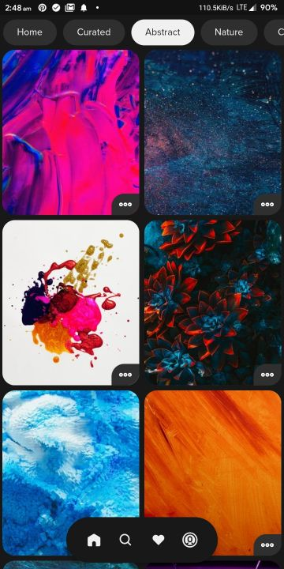
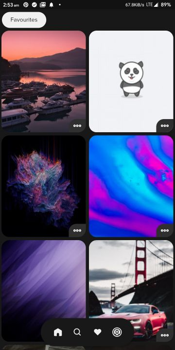
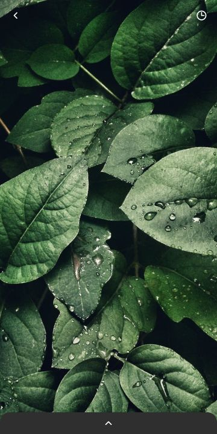
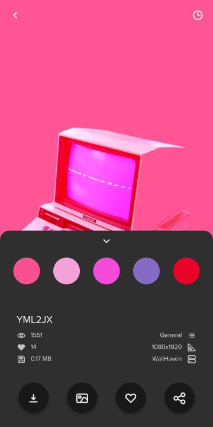

#  Prism

Prism is a beautiful open-source wallpapers app for Android. It is built with Dart on top of Google's Flutter Framework.


<a href='https://play.google.com/store/apps/details?id=com.hash.prism&pcampaignid=pcampaignidMKT-Other-global-all-co-prtnr-py-PartBadge-Mar2515-1'></a>

Prism offers an exclusive collection of wallpapers that are beautifully hand-crafted for your very specific device. This exclusive collection is hand-picked from all-around the world to give you the best illustration, graphics and photographs that look amazing in any setup that you want.

Prism relies on its Community and [WallHaven](https://wallhaven.cc/help/api) and [Pexels](https://www.pexels.com/api/) APIs as its source of beautiful and large collection of Wallpapers. By utilising their API, it provides the user with a fast and smooth experience filled with subtle animations and minimal design. The main goal of Prism is to make the smartphone customisation experience, smooth and easy, yet giving the users amazing wallpapers, and features like downloading infinite (as much your storage allows) wallpapers or sharing the ones they like with others.

Now users can upload wallpapers, which will be shown in the Community section. They can also view the wallpapers they uploaded in the Profile section.

Prism offers a never-ending feed of wallpapers on its home screen. It also has a Curated section that is filled with the best photos/wallpapers updated every day. It also features categories like Abstract, Nature, 4K, Art, Landscape, Minimal, Space, Neon, etc. if you are into these. Then it allows one to find wallpapers on the basis of colors, i.e. you can find wallpapers with a color that matches your icons or homescreen setup. Not even that, it also shows you a palette of colors from any wallpaper in the app, on clicking which you can find wallpapers of that specific color.

Main features like finding and setting up wallpapers don't rquire Google Sign In, while features like Favourites or Downloads require you to sign up using Google. This signup is facilitated by Google Firebase, so it is secure and we only get your name, email and profile photo for identification purposes. The app also has Dark Mode, if you want to save your phone's battery while getting in love with those wallpapers. The app also allows users to share wallpapers with others by giving them a unique link for every wallpaper, using Dynamic Links so that anyone can directly view the wallpaper.

## List of Contents

1. [Features](#features)
2. [Changelog](#changelog)
3. [Demo](#demo)
4. [Support](#support)
5. [Dependencies](#dependencies)
6. [Usage](#usage)
7. [Contributing](#contributing)
8. [License](#license)
9. [Contributors](#contributors)
10. [To-Do](#to-do)

## Features

- High-Quality Wallpapers from [WallHaven](https://wallhaven.cc/help/api) and [Pexels](https://www.pexels.com/api/)
- Over 300+ exclusive wallpapers, making it the best selection ever
- Community wallpapers uploaded by users all-around the world
- Dark Mode supported
- Optional Sign-in
- Each wallpaper has a unique link, makes sharing them easier
- Low Internet usage due to minimal loading and persistent data using Provider
- Save Liked Images for later (works even after uninstalling the app)
- Download any wallpaper to Gallery
- Secure data and favorites storage on Google Firebase
- Search for Wallpapers by keyword
- Check how the wallpaper will look with fake clock and app icons
- Search for Wallpapers by color
- Find wallpapers with a similar color
- Set any wallpaper on the home screen, lock screen or both
- Find wallpapers by category (Curated, Abstract, Nature, Landscape, Art, 4K, Sports, Architecture, Marvel, Neon, etc.)
- Extensive settings menu with various options
- Toast/Snackbar supported buttons
- Minimal design with smooth transitions and animations
- Clear Cache, Downloads and Favourites with one-tap
- Optimized storage using minimal packages
- Application size under 11 MB
- Adaptive UI (changes color based on wallpaper)

## Changelog

### v2.4.4
- Upto 24 new Categories added, full list [here](###categories)
- Added upload section
- Redesigned Profile section UI
- Major bug fixes

### v2.4.3
- Over 300+ exclusive wallpapers added
- Variants added, lets switch between color variants of a wallpaper
- Added new notification center
- Improved user experience overall 

### v2.4.2
- Improved overall notifications and permissions
- Added new color picker popup
- Added new notification center
- Minor bug fixes

### v2.4.1
- Minor bug fixes

### v2.4.0
- Major bug fixes and improvements
- Redesigned the wallpaper info sheet
- Added swipe to change categories
- Added Firebase analytics
- Added notifications support

### v2.3.5
- Major bug fixes and improvements

### v2.3.0
- Changed app icon and splash screen animations
- Added backwards compatibility for v1
- Redesigned profile page UI
- Fixed favourites and downloads

### v2.2.0
- Added clock overlay to test wallpapers
- Added ability to share wallpapers
- Added ability to clear app cache
- Major bug fixes and tweaks

### v2.0.0
- Completely new redesigned UI
- Added Pexels API support
- Added new color based search
- Added new themes
- Added 1M+ wallpapers
- Added non intrusive sign in support
- Added new quick wallpaper actions
- Added new palette generator

### v1.0.0
- Added the app on Play Store
- Wallpapers from WallHaven
- Multiple Themes supported (including dark and light themes)
- Sign in with Google support
- Save Liked Images for later (works even after uninstalling the app)
- Download any wallpaper to Gallery
- Search for Wallpapers by keyword
- Search for Wallpapers by colour
- Set any wallpaper on the home screen, lock screen or both
- Subtle Animations with Flare
- Toast/Snackbar supported buttons
- Clear Cache, Downloads and Favourites with one-tap
- Optimised storage using minimal packages
- Adaptive UI (changes colour based on wallpaper)

### Categories
- Home
- Curated
- For you
- Abstract
- Landscape
- Nature
- 4K
- Art
- Pattern
- Minimal
- Anime
- Textures
- Technology
- Monochrome
- Code
- Space
- Cars
- Animals
- Skyscape
- Neon
- Architecture
- Sports
- Marvel
- Music

## Demo

**Screens**

|  |  |  |  |  |
| :-------------: | :-------------:  | :-------------:  | :-------------:  | :-------------:  |
|     Explore     |    Curated    |    Abstract     |     Nature       |     Color Based     |


|  |  |  |  |  |
| :-------------: | :-------------:  | :-------------:  | :-------------:  | :-------------:  |
|     Color Picker    |    Favourites    |    Downloads     |     Search       |     Profile     |


|  | |        |   | |
| :-------------:  | :-------------: | :-------------:       | :-------------:  | :-------------: |
|  Sign-in Popup    |    Quick Action Menu       |  Wallpaper Display    | Wallpaper Info   | Clock for testing  |

|  |  |  |  |  |
| :-------------: | :-------------:  | :-------------:  | :-------------:  | :-------------:  |
|     Splash Screen    |    Loading Animation    |    Wallpaper Popup     |     Changelog       |     Wallpaper Info 2     |

**Light Theme**

|  | | |  | |
| :-------------:  | :-------------: | :-------------: | :-------------:  | :-------------: |
|  Explore  |Search|  Favourites    |      Downloads   |      Profile  |


## Support

If you like what we do, and would want to help us continue doing it, consider sponsoring this project.

<a href="https://www.buymeacoffee.com/HashStudios" target="_blank"></a>

Prism Wallpapers app is now available on Google Play, so you can support us by reviewing the app.

<a href='https://play.google.com/store/apps/details?id=com.hash.prism&pcampaignid=pcampaignidMKT-Other-global-all-co-prtnr-py-PartBadge-Mar2515-1'></a>
## Dependencies

The following packages are needed for the development of this application.

- `provider: ^4.1.3` for caching data, and state management
- `cached_network_image: ^2.2.0+1` for caching wallpapers
- `palette_generator: ^0.2.2` for generating wallpaper colors
- `fluttertoast: ^4.0.1` for toast notifications
- `gallery_saver: ^2.0.1` for saving wallpapers to gallery
- `shared_preferences: ^0.5.7` for storing settings like theme
- `share: ^0.6.4` for sharing the wallpaper links
- `url_launcher: ^5.4.5` for launching urls
- `cloud_firestore: ^0.13.5` for storing liked images and other user based data
- `firebase_core: ^0.4.4+3` for firebase support
- `firebase_auth: ^0.16.0` for user authentication
- `firebase_dynamic_links: ^0.5.1` for wallpaper link generation and handling
- `google_sign_in: ^4.4.4` for Google sign in support
- `permission_handler: ^5.0.1+1` for handling required device permissions
- `flare_splash_screen: ^3.0.1` for the animated splash screen
- `flutter_svg: 0.17.4` for svg assets
- `sliding_up_panel: ^1.0.2` for sliding info panel
- `firebase_analytics: ^5.0.16` for analytics
- `firebase_messaging: ^6.0.16` for notifications
- `in_app_purchase: ^0.3.4+1` for in-app purchases
- `flutter_local_notifications: ^1.4.4+2` for in-app local notifications
- `firebase_crashlytics: ^0.1.3+3` for handling crashes, and better reporting
- `screenshot: ^0.2.0` for setting wallpapers
- `tutorial_coach_mark: ^0.3.0` for showing new user tutorial
- `scroll_to_index: ^1.0.6` for scrolling lists
- `image_picker: ^0.6.7+4` for picking images
- `github: ^6.2.2` for communicating with GitHub API
- `photo_view: ^0.9.2` for showing images before uploading
- `flare_flutter: ^2.0.5` for animations
- `image: 2.1.12` for editing wallpapers

More details about these can be found in the [`pubspec.yaml`](https://github.com/Hash-Studios/Prism/tree/master/pubspec.yaml) file.

## Usage

The application files for Android devices can be found on [Google Play Store](https://play.google.com/store/apps/details?id=com.hash.prism).

More information about the releases can be found in the [Release](https://github.com/Hash-Studios/Prism/releases) tab.

## Contributing

First off, thank you for considering contributing to Prism. It's people like you that make Prism such a great app.

To start your lovely journey with Prism, first read the [`contributing guidelines`](https://github.com/Hash-Studios/Prism/tree/master/CONTRIBUTING.md) and then fork the repo to start contributing!

## License

This app is licensed under the [`BSD 3-Clause License`](https://github.com/Hash-Studios/Prism/tree/master/LICENSE.txt).
Any Usage of the source code must follow the below license.

```
BSD 3-Clause License

Copyright (c) 2020 Hash Studios
All rights reserved.

Redistribution and use in source and binary forms, with or without
modification, are permitted provided that the following conditions are met:

1. Redistributions of source code must retain the above copyright notice, this
   list of conditions and the following disclaimer.

2. Redistributions in binary form must reproduce the above copyright notice,
   this list of conditions and the following disclaimer in the documentation
   and/or other materials provided with the distribution.

3. Neither the name of the copyright holder nor the names of its
   contributors may be used to endorse or promote products derived from
   this software without specific prior written permission.

THIS SOFTWARE IS PROVIDED BY THE COPYRIGHT HOLDERS AND CONTRIBUTORS "AS IS"
AND ANY EXPRESS OR IMPLIED WARRANTIES, INCLUDING, BUT NOT LIMITED TO, THE
IMPLIED WARRANTIES OF MERCHANTABILITY AND FITNESS FOR A PARTICULAR PURPOSE ARE
DISCLAIMED. IN NO EVENT SHALL THE COPYRIGHT HOLDER OR CONTRIBUTORS BE LIABLE
FOR ANY DIRECT, INDIRECT, INCIDENTAL, SPECIAL, EXEMPLARY, OR CONSEQUENTIAL
DAMAGES (INCLUDING, BUT NOT LIMITED TO, PROCUREMENT OF SUBSTITUTE GOODS OR
SERVICES; LOSS OF USE, DATA, OR PROFITS; OR BUSINESS INTERRUPTION) HOWEVER
CAUSED AND ON ANY THEORY OF LIABILITY, WHETHER IN CONTRACT, STRICT LIABILITY,
OR TORT (INCLUDING NEGLIGENCE OR OTHERWISE) ARISING IN ANY WAY OUT OF THE USE
OF THIS SOFTWARE, EVEN IF ADVISED OF THE POSSIBILITY OF SUCH DAMAGE.
```

```
DISCLAIMER: Google Play and the Google Play logo are trademarks of Google LLC.
```

## Contributors

<a href="https://github.com/Hash-Studios/Prism/graphs/contributors">
  
</a>

## 


## To Do

- [ ] code refactoring
- [ ] user collections
- [ ] centrecrop java for search
