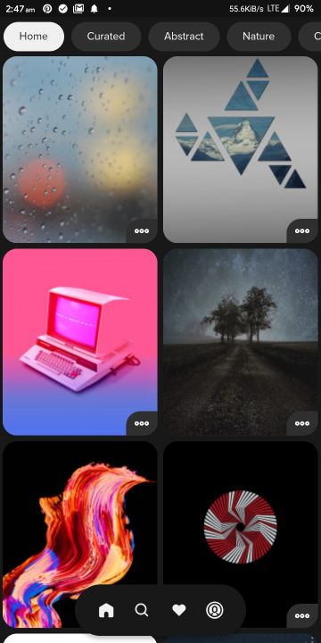
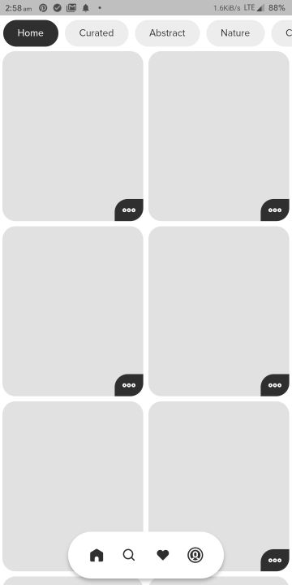
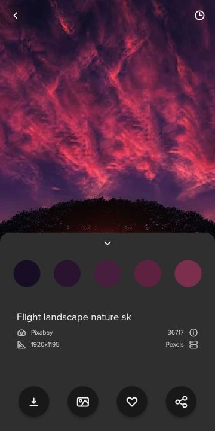

# <div align="center"> Prism</div>

<div align="center">Prism is a beautiful open-source wallpapers app for Android. It is built with Dart on top of Google's Flutter Framework.


<a href='https://twitter.com/PrismWallpapers'></a>

</div>
<a href='https://play.google.com/store/apps/details?id=com.hash.prism&pcampaignid=pcampaignidMKT-Other-global-all-co-prtnr-py-PartBadge-Mar2515-1'></a>

Prism offers an exclusive collection of wallpapers that are beautifully hand-crafted for your very specific device. This exclusive collection is hand-picked from all around the world to give you the best illustration, graphics, and photographs that look amazing in any setup that you want. Now Prism also offers an exclusive range of home screen setups, that you can simply apply. Each setup includes a wallpaper, an icon pack and a widget.

Prism relies on its Community and [WallHaven](https://wallhaven.cc/help/api) and [Pexels](https://www.pexels.com/api/) APIs as its source of beautiful and large collection of Wallpapers. By utilizing their API, it provides the user with a fast and smooth experience filled with subtle animations and minimal design. The main goal of Prism is to make the smartphone customization experience, smooth and easy, yet giving the users amazing wallpapers, and features like downloading infinite (as much your storage allows) wallpapers or sharing the ones they like with others.

Now users can upload wallpapers, which will be shown in the Community section. They can also view the wallpapers they uploaded in the Profile section. We generally take upto 24 hours for reviewing every wallpaper, but premium users get their wallpapers reviewed instantly.

Prism offers a never-ending feed of wallpapers on its home screen. It also has a Curated section that is filled with the best photos/wallpapers updated every day. It also features categories like Abstract, Nature, 4K, Art, Landscape, Minimal, Space, Neon, etc. if you are into these. Then it allows one to find wallpapers based on colors, i.e. you can find wallpapers with a color that matches your icons or home screen setup. Not even that, it also shows you a palette of colors from any wallpaper in the app, on clicking which you can find wallpapers of that specific color.

Main features like finding, downloading and setting up wallpapers don't require Google Sign In, while features like Favourites require you to sign up using Google. This signup is facilitated by Google Firebase, so it is secure and we only get your name, email, and profile photo for identification purposes. The app also has Dark Mode, if you want to save your phone's battery while getting in love with those wallpapers. The app also allows users to share wallpapers with others by giving them a unique link for every wallpaper, using Firebase Dynamic Links so that anyone can directly view the wallpaper.

### Introducing Prism Premium

Now get access to more premium and exclusive stuff by buying Prism Premium.

You get access to Variants (Set up to 5 color variants of each wallpaper!) and Setups (Get more exclusive Home Screen setups! Free version includes only 5 free setups).
Your uploads are also reviewed instantly, rather than the 24 hours time constraint in the free version.
You also get a PRO badge in front of your profile, plus you directly support the development of this forever ad-free app.

- The ability to view setups (only 5 are present in the free version)
- The ability to set variants of wallpapers
- Get PRO badge in front of your profile
- Get uploads reviewed instantly
- Get rid of all rewarded video ads(Used for downloads)
- Support development of the app

### Twitter

Prism Wallpapers is now on Twitter. We regularly share exclusive wallpapers, setups and organise giveaways.
Follow us there to stay notified. [https://twitter.com/PrismWallpapers](https://twitter.com/PrismWallpapers)

<a href='https://twitter.com/PrismWallpapers'></a>

## List of Contents

1. [Features](#features)
2. [Changelog](#changelog)
3. [Demo](#demo)
4. [Support](#support)
5. [Dependencies](#dependencies)
6. [Usage](#usage)
7. [Contributing](#contributing)
8. [License](#license)
9. [Privacy Policy](#privacy)
10. [Contributors](#contributors)
11. [To-Do](#to-do)

## Features

- High-Quality Wallpapers from [WallHaven](https://wallhaven.cc/help/api) and [Pexels](https://www.pexels.com/api/)
- Over 500+ exclusive wallpapers, making it the best selection ever
- Community wallpapers uploaded by users all-around the world
- Homescreen setups - Unique and exclusive setups designed with the perfect combination of wallpapers, icon pack and widgets
- Exclusive collections updated daily
- Each wallpaper comes with 5 color variants
- Dark Mode supported
- Optional Sign-in
- Each wallpaper has a unique link, makes sharing them easier
- Low Internet usage due to minimal loading and persistent data using Provider/ CacheNetworkImage
- Save Liked Images for later (works even after uninstalling the app)
- Download any wallpaper to Gallery by watching a quick video ad
- Secure data and favorites storage on Google Firebase
- Search for Wallpapers by keyword
- Check how the wallpaper will look with fake clock and app icons
- Search for Wallpapers by color
- Find wallpapers with a similar color
- Set any wallpaper on the home screen, lock screen or both
- Find wallpapers by category (Curated, Abstract, Nature, Landscape, Art, 4K, Sports, Architecture, Marvel, Neon, etc.)
- Extensive settings menu with various options
- Toast/Snackbar supported buttons
- Minimal design with smooth transitions and animations
- Clear Cache, Downloads and Favourites with one-tap
- Optimized storage using minimal packages
- Application size under 14 MB
- Adaptive UI (changes color based on wallpaper)

## Changelog

Full changelog can be found [here](https://github.com/Hash-Studios/Prism/tree/master/CHANGELOG.md).

### v2.5.5
- Premium uploads get reviewed instantly now
- Added collections, find similar wallpapers easily
- Update popup replaced with update notification
- Update app tutorial
- Bumped up the targetSDK, compileSDK to 29
- Major bug fixes

### v2.5.4
- Updated password authentication in GitHub API to Personal access token based
- Added wallpaper editing options before uploading
- Improved overall caching, leading to low internet usage
- Major bug fixes

### v2.5.3
- Added set wallpaper Action Dialog
- Fixed set wallpaper intent
- Added long press to crop and tap to set
- Added notifications subscription
- Added all-new notifications center
- Minor bug fixes

### v2.5.2
- Added carousel widget in home screen
- Added rewarded video ads for wallpaper downloads
- Now download wallpapers, without sign-in
- Variants can now also be downloaded by watching an ad
- Added all-new notifications center
- Minor bug fixes


## Demo

**Screens**

|  |  |  |  |  |
| :-------------: | :-------------:  | :-------------:  | :-------------:  | :-------------:  |
|     Home     |    Search WallHaven   |    Search Pexels     |     Color Picker       |     Color Based     |

|  |  |  |  |  |
| :-------------:  | :-------------:  | :-------------:  | :-------------:  | :-------------:  |
|    Favourites    |    Downloads     |     Setups       |    Setups Info    |     Profile     |

|  | |        |   |  |
| :-------------:  | :-------------: | :-------------:       | :-------------:  | :-------------:  |
|  Upload Popup    |    Edit Wallpaper       |  Uploading Wallpaper    | Uploader's Profile   |     Scroll to Top Button       |

|  |  | |  |  |
| :-------------: | :-------------: | :-------------: | :-------------:  | :-------------:  |
|     Categories     |     Collections    | Collection (Shapes)  |    Notifications     |     Textures       |

|  |  |        |   | |
| :-------------:  | :-------------:  | :-------------:       | :-------------:  | :-------------: |
|     Premium Info       |     Premium Page    |  Wallpaper Display    | Clock for testing   | Wallpaper Info  |

|  |  |  |  |  |
| :-------------: | :-------------:  | :-------------:  | :-------------:  | :-------------:  |
|     Splash Screen    |    Quick Action Menu    |    Settings     |     Theme Switcher Dark       |     Theme Switcher Light    |

This theme switcher toggle button was inspired by [Shubham](https://github.com/shubhamhackz) and you can check out his code [here](https://github.com/shubhamhackz/light_dark_toggle).

**Light Theme**

|  | | |  | |
| :-------------:  | :-------------: | :-------------: | :-------------:  | :-------------: |
|  Home  |Search|  Favourites    |      Setups   |      Profile  |


## Support

If you like what we do, and would want to help us continue doing it, consider sponsoring this project.

<a href="https://www.buymeacoffee.com/HashStudios" target="_blank"></a>

Prism Wallpapers app is now available on Google Play, so you can support us by giving a rating to the app.

<a href='https://play.google.com/store/apps/details?id=com.hash.prism&pcampaignid=pcampaignidMKT-Other-global-all-co-prtnr-py-PartBadge-Mar2515-1'></a>


## Dependencies

The following packages are needed for the development of this application.

- `share: ^0.6.4` for sharing the wallpaper links
- `url_launcher: ^5.4.5` for launching urls
- `cloud_firestore: ^0.13.5` for storing liked images and other user based data
- `firebase_core: ^0.4.4+3` for firebase support
- `firebase_auth: ^0.16.0` for user authentication
- `google_sign_in: ^4.4.4` for Google sign in support
- `flare_splash_screen: ^3.0.1` for the animated splash screen
- `provider: ^4.1.3` for caching data, and state management
- `flutter_svg: 0.17.4` for svg assets
- `palette_generator: ^0.2.2` for generating wallpaper colors
- `fluttertoast: ^4.0.1` for toast notifications
- `gallery_saver: ^2.0.1` for saving wallpapers to gallery
- `firebase_dynamic_links: ^0.5.1` for wallpaper link generation and handling
- `permission_handler: ^5.0.1+1` for handling required device permissions
- `sliding_up_panel: ^1.0.2` for sliding info panel
- `firebase_analytics: ^5.0.16` for analytics
- `firebase_messaging: ^6.0.16` for notifications
- `in_app_purchase: ^0.3.4+1` for in-app purchases
- `firebase_crashlytics: ^0.1.3+3` for handling crashes, and better reporting
- `screenshot: ^0.2.0` for setting wallpapers
- `tutorial_coach_mark: ^0.3.0` for showing new user tutorial
- `scroll_to_index: ^1.0.6` for scrolling lists
- `image_picker: ^0.6.7+4` for picking images
- `github: ^6.2.2` for communicating with GitHub API
- `photo_view: ^0.9.2` for showing images before uploading
- `cached_network_image: ^2.2.0+1` for caching wallpapers
- `flare_flutter: ^2.0.5` for animations
- `hive: ^1.4.1+1` for caaching data
- `hive_flutter: ^0.3.0+1` for caching data
- `path_provider: ^1.6.11` for getting Application storage directory path
- `flutter_windowmanager: ^0.0.2` for adding security flags
- `purchases_flutter: ^1.2.1` for RevenueCat support
- `firebase_remote_config: ^0.3.1+1` for manipulating the app remotely
- `data_connection_checker: ^0.3.4` for checking Internet connection
- `carousel_slider: ^2.2.1` for carousel widget
- `firebase_admob: ^0.9.3+4` for rewarded video ads
- `image_editor: ^0.7.1` for editing wallpapers during upload
- `extended_image: ^0.9.0` for cropping wallpapers before uploading
- `device_info: ^0.4.2+7` for getting device info for bug reports

More details about these can be found in the [`pubspec.yaml`](https://github.com/Hash-Studios/Prism/tree/master/pubspec.yaml) file.

## Usage

The application files for Android devices can be found on [Google Play Store](https://play.google.com/store/apps/details?id=com.hash.prism).

More information about the releases can be found in the [Release](https://github.com/Hash-Studios/Prism/releases) tab.

## Contributing

First off, thank you for considering contributing to Prism. It's people like you that make Prism such a great app.

To start your lovely journey with Prism, first read the [`contributing guidelines`](https://github.com/Hash-Studios/Prism/tree/master/CONTRIBUTING.md) and then fork the repo to start contributing!

## License

This app is licensed under the [`BSD 3-Clause License`](https://github.com/Hash-Studios/Prism/tree/master/LICENSE.txt).
Any Usage of the source code must follow the below license.

```
BSD 3-Clause License

Copyright (c) 2020 Hash Studios
All rights reserved.

Redistribution and use in source and binary forms, with or without
modification, are permitted provided that the following conditions are met:

1. Redistributions of source code must retain the above copyright notice, this
   list of conditions and the following disclaimer.

2. Redistributions in binary form must reproduce the above copyright notice,
   this list of conditions and the following disclaimer in the documentation
   and/or other materials provided with the distribution.

3. Neither the name of the copyright holder nor the names of its
   contributors may be used to endorse or promote products derived from
   this software without specific prior written permission.

THIS SOFTWARE IS PROVIDED BY THE COPYRIGHT HOLDERS AND CONTRIBUTORS "AS IS"
AND ANY EXPRESS OR IMPLIED WARRANTIES, INCLUDING, BUT NOT LIMITED TO, THE
IMPLIED WARRANTIES OF MERCHANTABILITY AND FITNESS FOR A PARTICULAR PURPOSE ARE
DISCLAIMED. IN NO EVENT SHALL THE COPYRIGHT HOLDER OR CONTRIBUTORS BE LIABLE
FOR ANY DIRECT, INDIRECT, INCIDENTAL, SPECIAL, EXEMPLARY, OR CONSEQUENTIAL
DAMAGES (INCLUDING, BUT NOT LIMITED TO, PROCUREMENT OF SUBSTITUTE GOODS OR
SERVICES; LOSS OF USE, DATA, OR PROFITS; OR BUSINESS INTERRUPTION) HOWEVER
CAUSED AND ON ANY THEORY OF LIABILITY, WHETHER IN CONTRACT, STRICT LIABILITY,
OR TORT (INCLUDING NEGLIGENCE OR OTHERWISE) ARISING IN ANY WAY OUT OF THE USE
OF THIS SOFTWARE, EVEN IF ADVISED OF THE POSSIBILITY OF SUCH DAMAGE.
```

```
DISCLAIMER: Google Play and the Google Play logo are trademarks of Google LLC.
```
## Privacy

We store all our data on Firebase and GitHub servers, and we do not store personal information of the user.
Link to the full privacy policy can be found [here](https://github.com/Hash-Studios/Prism/tree/master/PRIVACY.md).

**Privacy Policy**

Hash Studios built the Prism app as an Open Source app. This SERVICE is provided by Hash Studios at no cost and is intended for use as is.

This page is used to inform visitors regarding our policies with the collection, use, and disclosure of Personal Information if anyone decided to use our Service.

If you choose to use our Service, then you agree to the collection and use of information in relation to this policy. The Personal Information that we collect is used for providing and improving the Service. We will not use or share your information with anyone except as described in this Privacy Policy.

The terms used in this Privacy Policy have the same meanings as in our Terms and Conditions, which is accessible at Prism unless otherwise defined in this Privacy Policy.

**Information Collection and Use**

For a better experience, while using our Service, we may require you to provide us with certain personally identifiable information, including but not limited to name, email, profile image. The information that we request will be retained by us and used as described in this privacy policy.

The app does use third party services that may collect information used to identify you.

Link to privacy policy of third party service providers used by the app

*   [Google Play Services](https://www.google.com/policies/privacy/)
*   [Google Analytics for Firebase](https://firebase.google.com/policies/analytics)
*   [Firebase Crashlytics](https://firebase.google.com/support/privacy/)

**Log Data**

We want to inform you that whenever you use our Service, in a case of an error in the app we collect data and information (through third party products) on your phone called Log Data. This Log Data may include information such as your device Internet Protocol (“IP”) address, device name, operating system version, the configuration of the app when utilizing our Service, the time and date of your use of the Service, and other statistics.

**Cookies**

Cookies are files with a small amount of data that are commonly used as anonymous unique identifiers. These are sent to your browser from the websites that you visit and are stored on your device's internal memory.

This Service does not use these “cookies” explicitly. However, the app may use third party code and libraries that use “cookies” to collect information and improve their services. You have the option to either accept or refuse these cookies and know when a cookie is being sent to your device. If you choose to refuse our cookies, you may not be able to use some portions of this Service.

**Service Providers**

We may employ third-party companies and individuals due to the following reasons:

*   To facilitate our Service;
*   To provide the Service on our behalf;
*   To perform Service-related services; or
*   To assist us in analyzing how our Service is used.

We want to inform users of this Service that these third parties have access to your Personal Information. The reason is to perform the tasks assigned to them on our behalf. However, they are obligated not to disclose or use the information for any other purpose.

**Security**

We value your trust in providing us your Personal Information, thus we are striving to use commercially acceptable means of protecting it. But remember that no method of transmission over the internet, or method of electronic storage is 100% secure and reliable, and we cannot guarantee its absolute security.

**Links to Other Sites**

This Service may contain links to other sites. If you click on a third-party link, you will be directed to that site. Note that these external sites are not operated by us. Therefore, we strongly advise you to review the Privacy Policy of these websites. We have no control over and assume no responsibility for the content, privacy policies, or practices of any third-party sites or services.

**Children’s Privacy**

These Services do not address anyone under the age of 13. We do not knowingly collect personally identifiable information from children under 13\. In the case we discover that a child under 13 has provided us with personal information, we immediately delete this from our servers. If you are a parent or guardian and you are aware that your child has provided us with personal information, please contact us so that we will be able to do necessary actions.

**Changes to This Privacy Policy**

We may update our Privacy Policy from time to time. Thus, you are advised to review this page periodically for any changes. We will notify you of any changes by posting the new Privacy Policy on this page.

This policy is effective as of 2020-07-18

**Contact Us**

If you have any questions or suggestions about our Privacy Policy, do not hesitate to contact us at hash.studios.inc@gmail.com.

## Contributors

<a href="https://github.com/Hash-Studios/Prism/graphs/contributors">
  
</a>

## If you made it here, thanks for your support. You can show more support by forking or starring this repo. See ya!