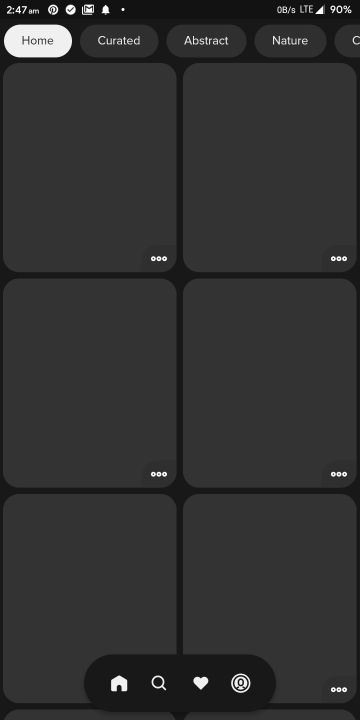
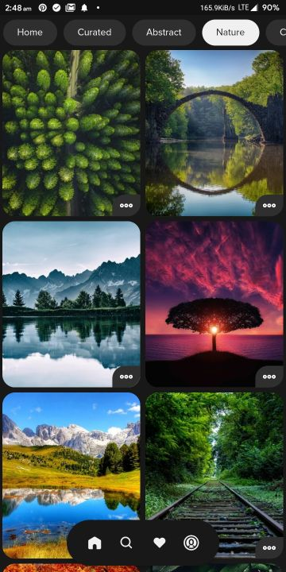
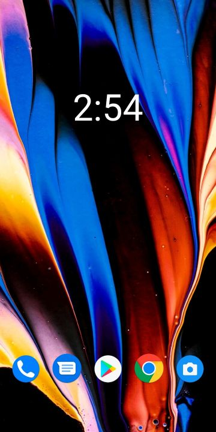
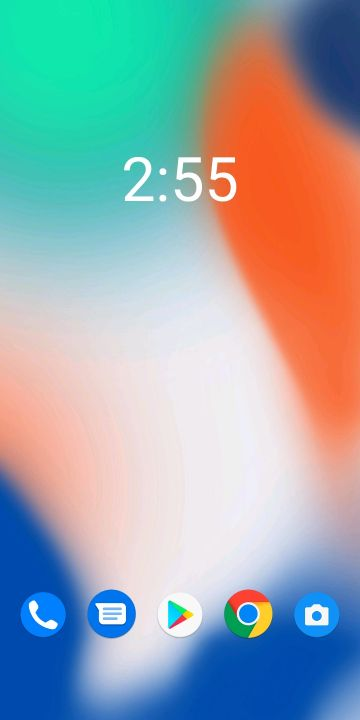
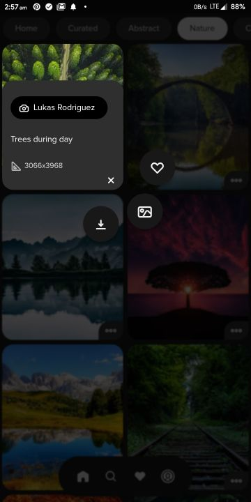
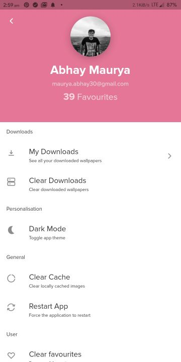
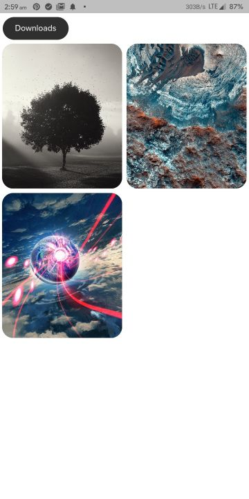
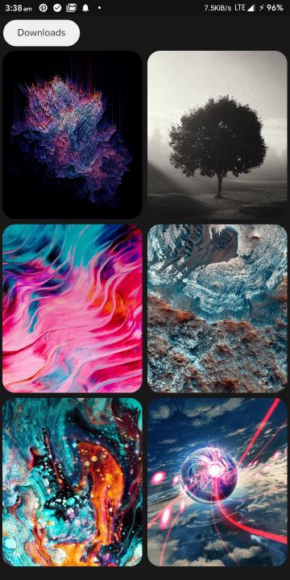
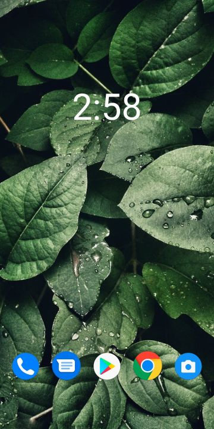

# <div align="center"> Prism</div>

<div align="center">Prism is a beautiful open-source wallpapers app for Android. It is built with Dart on top of Google's Flutter Framework.


<a href='https://twitter.com/PrismWallpapers'></a>
<a href='https://t.me/PrismWallpapers'></a>

</div>
<a href='https://play.google.com/store/apps/details?id=com.hash.prism&pcampaignid=pcampaignidMKT-Other-global-all-co-prtnr-py-PartBadge-Mar2515-1'></a>

<b>Prism</b> brings you exclusive wallpapers & setups straight to your Android device.
With unlimited downloads and favourites, you can be sure to never miss the best wallpapers & setups.

Our main goal is to create an unimaginable self-sustainable experience where people can share their walls and setups with the world, and everyone can like, download, and apply them.

<b>➡WALLPAPERS</b>
- High-Quality Wallpapers from [WallHaven](https://wallhaven.cc/help/api) and [Pexels](https://www.pexels.com/api/)
- Beautiful wallpapers uploaded by verified users
- Community wallpapers uploaded by users all around the world
- Favourite, set, and share walls
- Browse wallpapers from the creators you follow
- Apply wallpaper from quick tile
- Download the ones you like
- Apply filters on wallpapers (Clarendon, Hudson, Mayfair, and 20+ more filters)
- Edit and upload your wallpapers
- Each wallpaper comes with 5 variants
- Generate palette for any wallpaper
- Search walls by keywords, color, or tags
- Preview the wallpaper with clock and app icons before applying
- Set any wallpaper on the home screen, lock screen or both

<b>➡SETUPS</b>
- Best community made home screen setups
- Unique browsing experience for viewing setups
- High-quality setups uploaded weekly
- Weekly giveaway contest for setups
- Upload your setups for free!
- Favourite & share the ones you like

<b>➡COLLECTIONS</b>
- Premium wallpaper collections made exclusively by hand!
- Updated daily!
- Unique random collection to find hidden gems
- 30+ exclusive categories from WallHaven and Pexels

<b>➡PROFILE</b>
- Upload walls & setups!
- Create your wallpaper resume and get verified!
- Follow other creators!
- Promote your social media handles!
- Share your profile easily with others

<b>➡AND MORE...</b>
- AMOLED Dark mode built-in
- Cloud sync your data with Google sign-in
- Unique in-app notification center for less disturbing notifications
- Secure data and favourites storage
- 10+ themes to customise the look and feel of the app
- Fresh, beautiful design with smooth animations
- Clear Cache, Downloads, or Favourites with one-tap
- Low internet usage with excessive caching
- In-built wallpaper optimisation and sketchy walls filter.

<b>Introducing Prism Premium -</b>
Now get access to more premium and exclusive stuff by buying Prism Premium. It also removes the download wallpaper ad.

- Support development of the app
- Be a part of exclusive giveaways
- The ability to set and view details of setups (only 5 free setups can be applied in the free version)
- The ability to use wallpaper filters
- Get uploads reviewed instantly
- Get rid of all rewarded video ads (Used for downloads)
- Get PRO badge in front of your profile
- The ability to view premium collections

Feel free to contact us for any issues, hash.studios.inc@gmail.com

Join beta for the latest experimental builds and help us test the app, [https://play.google.com/apps/testing/com.hash.prism](https://play.google.com/apps/testing/com.hash.prism)

Also, we regularly organize giveaways, share exclusive setups and wallpapers on Twitter, so follow us there [https://twitter.com/PrismWallpapers](https://twitter.com/PrismWallpapers)

You can also report bugs, upload your setups/walls on our telegram channel
[https://t.me/PrismWallpapers](https://t.me/PrismWallpapers)

## List of Contents

1. [Features](#features)
2. [Changelog](#changelog)
3. [Demo](#demo)
4. [Support](#support)
5. [Dependencies](#dependencies)
6. [Usage](#usage)
7. [Contributing](#contributing)
8. [License](#license)
9. [Privacy Policy](#privacy)
10. [Contributors](#contributors)
11. [To-Do](#to-do)

## Features

- High-Quality Wallpapers from [WallHaven](https://wallhaven.cc/help/api) and [Pexels](https://www.pexels.com/api/)
- Over 2000+ exclusive wallpapers, making it the best selection ever
- Community wallpapers uploaded by users all-around the world
- Homescreen setups - Unique and exclusive setups designed with the perfect combination of wallpapers, icon pack and widgets
- Exclusive collections updated daily with premium wallpapers
- Each wallpaper comes with 5 color variants and 20+ filters
- Follow creators for the latest and greatest
- AMOLED Dark Mode supported
- Optional Sign-in
- Each wallpaper/setup/creator has a unique link, makes sharing them easier
- Option to add Twitter/Instagram to your profile
- Low Internet usage due to minimal loading and persistent data using Provider/ CacheNetworkImage
- Save Liked Images for later (works even after uninstalling the app)
- Download any wallpaper to Gallery by watching a quick video ad
- Set random wallpaper from the downloaded ones, by using quick tile
- Secure data and favorites storage on Google Firebase
- Search for Wallpapers by keyword
- Check how the wallpaper will look with fake clock and app icons
- Search for Wallpapers by color
- Find wallpapers with a similar color
- Set any wallpaper on the home screen, lock screen or both
- Find wallpapers by category (Curated, Abstract, Nature, Landscape, Art, 4K, Sports, Architecture, Marvel, Neon, etc.)
- Extensive settings menu with various options
- Toast/Snackbar supported buttons
- Minimal design with smooth transitions and animations
- Clear Cache, Downloads and Favourites with one-tap
- Optimized storage using minimal packages
- Application size about 12 MB
- Adaptive UI (changes color based on wallpaper)

## Changelog

Full changelog can be found [here](https://github.com/Hash-Studios/Prism/tree/master/CHANGELOG.md).

### v2.6.9
- Laid support for Prism v3
- New model for users
- Removed banner ads
- Show an information sheet when ads don't load
- Fixed the downloads bug
- Add an option to save setups as drafts before uploading.
- New improved profiles with username, bio, cover photo, links & more!
- Added 20+ new filters
- Added option to pick icons from a given list of apps
- Minor bug fixes and improvements

## Demo

**Screens**

|  |  |  |  |  |
| :-------------: | :-------------:  | :-------------:  | :-------------:  | :-------------:  |
|     Home     |    Search WallHaven   |    Search Pexels     |     Trending       |     Color Based     |

|  |  |  |  |  |
| :-------------:  | :-------------:  | :-------------:  | :-------------:  | :-------------:  |
|    Favourites    |    Downloads     |     Setups       |    Setups Info    |     Profile     |

|  | |        |   |  |
| :-------------:  | :-------------: | :-------------:       | :-------------:  | :-------------:  |
|  Upload Popup    |    Edit Wallpaper       |  Uploading Wallpaper    | Uploader's Profile   |     Scroll to Top Button       |

|  |  | |  |  |
| :-------------: | :-------------: | :-------------: | :-------------:  | :-------------:  |
|     Categories     |     Collections    | Collection (Illustrations)  |    Setup Guidelines     |     Setup Upload       |

|  |  |        |   | |
| :-------------:  | :-------------:  | :-------------:       | :-------------:  | :-------------: |
|     About Page       |     Premium Page    |  Wallpaper Display    | Clock for testing   | Wallpaper Info  |

|  |  |  |  |  |
| :-------------: | :-------------:  | :-------------:  | :-------------:  | :-------------:  |
|     Splash Screen    |    Quick Action Menu    |    Settings     |     Themes      |     Notifications    |

|  |  |  |  |  |
| :-------------: | :-------------:  | :-------------:  | :-------------:  | :-------------:  |
|     Followers Feed    |    Theme Preference    |    Notification Settings     |     Onboarding      |     Top Followers    |

**Themes**

|  | | |  | |
| :-------------:  | :-------------: | :-------------: | :-------------:  | :-------------: |
|  Frosty White  |Coffee|  AMOLED    |      Rose   |      Cotton  |

...and 10 more!

## Support

If you like what we do, and would want to help us continue doing it, consider sponsoring this project. We also upload exclusive artworks/wallpapers here.

<a href="https://www.buymeacoffee.com/HashStudios" target="_blank"></a>

Prism Wallpapers app is now available on Google Play, so you can support us by giving a rating to the app.

<a href='https://play.google.com/store/apps/details?id=com.hash.prism&pcampaignid=pcampaignidMKT-Other-global-all-co-prtnr-py-PartBadge-Mar2515-1'></a>


## Dependencies

The following packages are needed for the development of this application.

- `animations: ^2.0.0` for dialog/transition animations
- `cached_network_image: ^3.0.0` for caching wallpapers
- `carousel_slider: ^3.0.0` for carousel widget
- `cloud_firestore: ^1.0.7` for storing liked images and other user based data
- `confetti: ^0.5.5` for showing confetti animations
- `data_connection_checker: ^0.3.4` for checking Internet connection
- `device_apps: ^2.1.1` for opening installed apps from Prism
- `device_info: ^2.0.0` for getting device info for bug reports
- `extended_image: ^0.9.0` for cropping wallpapers before uploading
- `firebase_analytics: ^8.0.2` for analytics
- `firebase_auth: ^1.1.2` for user authentication
- `firebase_core: ^1.1.0` for firebase support
- `firebase_dynamic_links: ^0.5.1` for wallpaper link generation and handling
- `firebase_messaging: ^9.1.3` for notifications
- `firebase_remote_config: ^0.6.0` for manipulating the app remotely
- `flare_flutter: ^2.0.5` for animations
- `flare_splash_screen: ^3.0.1` for the animated splash screen
- `flutter_displaymode: ^0.3.1-nullsafety.0` for checking display resolution and refresh rate
- `flutter_image_compress: ^1.0.0` for compressing uploaded images
- `flutter_local_notifications: ^5.0.0+3` for showing local notifications
- `flutter_staggered_grid_view: ^0.4.0` for showing staggered grid view in followers feed
- `flutter_svg: ^0.22.0` for svg assets
- `fluttertoast: ^8.0.6` for toast notifications
- `gallery_saver: ^2.1.0` for saving wallpapers to gallery
- `github: ^8.1.0` for communicating with GitHub API
- `google_mobile_ads: ^0.13.0` for rewarded video ads
- `google_sign_in: ^5.0.2` for Google sign in support
- `hive: ^2.0.4` for caching data
- `hive_flutter: ^1.0.0` for caching data
- `image: ^3.0.2` for image
- `image_editor: ^0.7.1` for editing wallpapers during upload
- `image_picker: ^0.7.4` for picking images
- `in_app_update: ^2.0.0` for updating app
- `palette_generator: ^0.3.0` for generating wallpaper colors
- `path_provider: ^2.0.1` for getting Application storage directory path
- `permission_handler: ^7.1.0` for handling required device permissions
- `photo_view: ^0.11.1` for showing images before uploading
- `photofilters: ^2.0.1` for editing filters
- `provider: ^4.1.3` for caching data, and state management
- `purchases_flutter: ^3.2.1` for RevenueCat support
- `quick_actions: ^0.6.0+1` for showing shortcuts/quick actions in launcher
- `rate_my_app: ^1.1.0+1` for showing app rating popup
- `screenshot: ^0.3.0` for setting wallpapers
- `share: ^2.0.1` for sharing the wallpaper links
- `sliding_up_panel: ^2.0.0+1` for sliding info panel
- `smooth_star_rating: ^1.1.1` for showing rate dialog
- `timeago: ^3.0.2` for showing time in a readible manner
- `url_launcher: ^6.0.3` for launching urls

More details about these can be found in the [`pubspec.yaml`](https://github.com/Hash-Studios/Prism/tree/master/pubspec.yaml) file.

## Usage

The application files for Android devices can be found on [Google Play Store](https://play.google.com/store/apps/details?id=com.hash.prism).

More information about the releases can be found in the [Release](https://github.com/Hash-Studios/Prism/releases) tab.

## Contributing

First off, thank you for considering contributing to Prism. It's people like you that make Prism such a great app.

To start your lovely journey with Prism, first read the [`contributing guidelines`](https://github.com/Hash-Studios/Prism/tree/master/CONTRIBUTING.md) and then fork the repo to start contributing!

## License

This app is licensed under the [`BSD 3-Clause License`](https://github.com/Hash-Studios/Prism/tree/master/LICENSE.txt).
Any Usage of the source code must follow the below license.

```
BSD 3-Clause License

Copyright (c) 2020 Hash Studios
All rights reserved.

Redistribution and use in source and binary forms, with or without
modification, are permitted provided that the following conditions are met:

1. Redistributions of source code must retain the above copyright notice, this
   list of conditions and the following disclaimer.

2. Redistributions in binary form must reproduce the above copyright notice,
   this list of conditions and the following disclaimer in the documentation
   and/or other materials provided with the distribution.

3. Neither the name of the copyright holder nor the names of its
   contributors may be used to endorse or promote products derived from
   this software without specific prior written permission.

THIS SOFTWARE IS PROVIDED BY THE COPYRIGHT HOLDERS AND CONTRIBUTORS "AS IS"
AND ANY EXPRESS OR IMPLIED WARRANTIES, INCLUDING, BUT NOT LIMITED TO, THE
IMPLIED WARRANTIES OF MERCHANTABILITY AND FITNESS FOR A PARTICULAR PURPOSE ARE
DISCLAIMED. IN NO EVENT SHALL THE COPYRIGHT HOLDER OR CONTRIBUTORS BE LIABLE
FOR ANY DIRECT, INDIRECT, INCIDENTAL, SPECIAL, EXEMPLARY, OR CONSEQUENTIAL
DAMAGES (INCLUDING, BUT NOT LIMITED TO, PROCUREMENT OF SUBSTITUTE GOODS OR
SERVICES; LOSS OF USE, DATA, OR PROFITS; OR BUSINESS INTERRUPTION) HOWEVER
CAUSED AND ON ANY THEORY OF LIABILITY, WHETHER IN CONTRACT, STRICT LIABILITY,
OR TORT (INCLUDING NEGLIGENCE OR OTHERWISE) ARISING IN ANY WAY OUT OF THE USE
OF THIS SOFTWARE, EVEN IF ADVISED OF THE POSSIBILITY OF SUCH DAMAGE.
```

```
DISCLAIMER: Google Play and the Google Play logo are trademarks of Google LLC.
```
## Privacy

We store all our data on Firebase and GitHub servers, and we do not store personal information of the user.
Link to the full privacy policy can be found [here](https://github.com/Hash-Studios/Prism/tree/master/PRIVACY.md).

**Privacy Policy**

Hash Studios built the Prism app as an Open Source app. This SERVICE is provided by Hash Studios at no cost and is intended for use as is.

This page is used to inform visitors regarding our policies with the collection, use, and disclosure of Personal Information if anyone decided to use our Service.

If you choose to use our Service, then you agree to the collection and use of information in relation to this policy. The Personal Information that we collect is used for providing and improving the Service. We will not use or share your information with anyone except as described in this Privacy Policy.

The terms used in this Privacy Policy have the same meanings as in our Terms and Conditions, which is accessible at Prism unless otherwise defined in this Privacy Policy.

**Information Collection and Use**

For a better experience, while using our Service, we may require you to provide us with certain personally identifiable information, including but not limited to name, email, profile image. The information that we request will be retained by us and used as described in this privacy policy.

The app does use third party services that may collect information used to identify you.

Link to privacy policy of third party service providers used by the app

*   [Google Play Services](https://www.google.com/policies/privacy/)
*   [Google Analytics for Firebase](https://firebase.google.com/policies/analytics)
*   [Firebase Crashlytics](https://firebase.google.com/support/privacy/)

**Log Data**

We want to inform you that whenever you use our Service, in a case of an error in the app we collect data and information (through third party products) on your phone called Log Data. This Log Data may include information such as your device Internet Protocol (“IP”) address, device name, operating system version, the configuration of the app when utilizing our Service, the time and date of your use of the Service, and other statistics.

**Cookies**

Cookies are files with a small amount of data that are commonly used as anonymous unique identifiers. These are sent to your browser from the websites that you visit and are stored on your device's internal memory.

This Service does not use these “cookies” explicitly. However, the app may use third party code and libraries that use “cookies” to collect information and improve their services. You have the option to either accept or refuse these cookies and know when a cookie is being sent to your device. If you choose to refuse our cookies, you may not be able to use some portions of this Service.

**Service Providers**

We may employ third-party companies and individuals due to the following reasons:

*   To facilitate our Service;
*   To provide the Service on our behalf;
*   To perform Service-related services; or
*   To assist us in analyzing how our Service is used.

We want to inform users of this Service that these third parties have access to your Personal Information. The reason is to perform the tasks assigned to them on our behalf. However, they are obligated not to disclose or use the information for any other purpose.

**Security**

We value your trust in providing us your Personal Information, thus we are striving to use commercially acceptable means of protecting it. But remember that no method of transmission over the internet, or method of electronic storage is 100% secure and reliable, and we cannot guarantee its absolute security.

**Links to Other Sites**

This Service may contain links to other sites. If you click on a third-party link, you will be directed to that site. Note that these external sites are not operated by us. Therefore, we strongly advise you to review the Privacy Policy of these websites. We have no control over and assume no responsibility for the content, privacy policies, or practices of any third-party sites or services.

**Children’s Privacy**

These Services do not address anyone under the age of 13. We do not knowingly collect personally identifiable information from children under 13\. In the case we discover that a child under 13 has provided us with personal information, we immediately delete this from our servers. If you are a parent or guardian and you are aware that your child has provided us with personal information, please contact us so that we will be able to do necessary actions.

**Changes to This Privacy Policy**

We may update our Privacy Policy from time to time. Thus, you are advised to review this page periodically for any changes. We will notify you of any changes by posting the new Privacy Policy on this page.

This policy is effective as of 2020-07-18

**Contact Us**

If you have any questions or suggestions about our Privacy Policy, do not hesitate to contact us at hash.studios.inc@gmail.com.

## Contributors

<a href="https://github.com/Hash-Studios/Prism/graphs/contributors">
  
</a>

## If you made it here, thanks for your support. You can show more support by forking or starring this repo. See ya!
