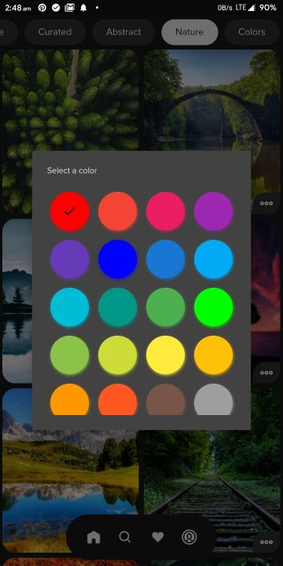
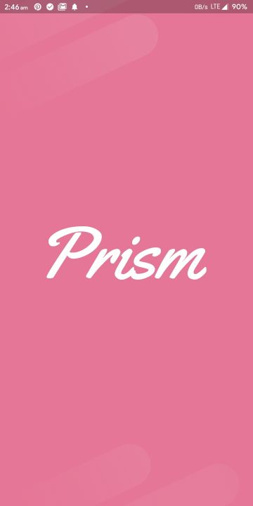
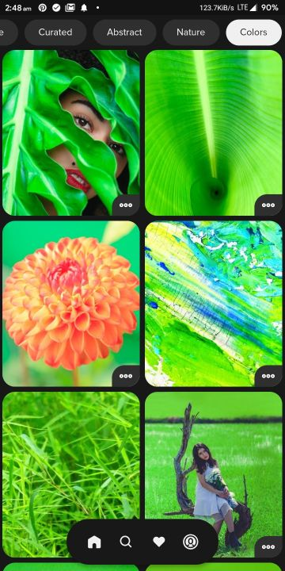
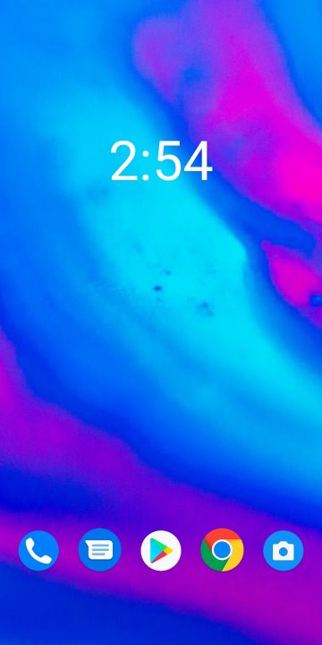
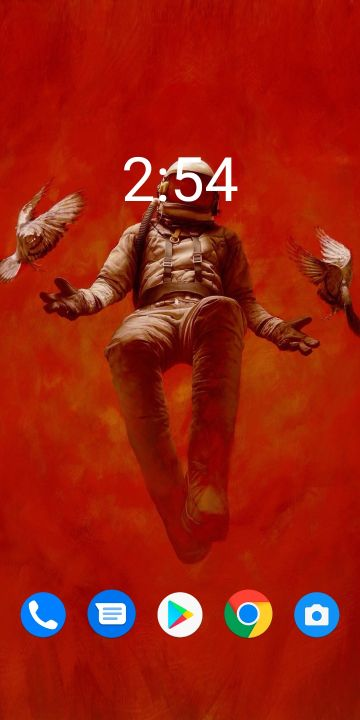
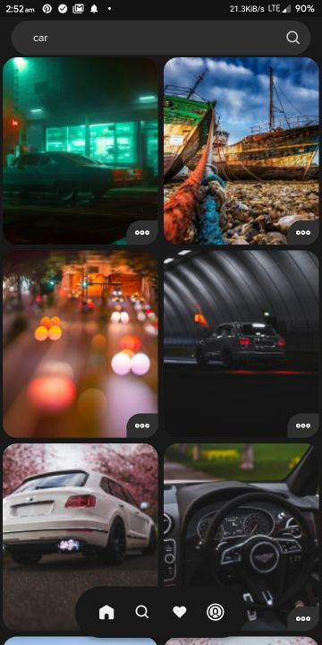
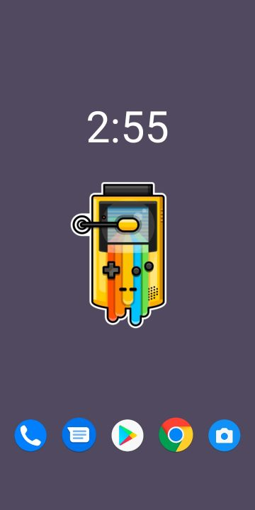

#  Prism

Prism is a beautiful open-source wallpapers app for Android. It is built with Dart on top of Google's Flutter Framework.


Prism gets its source of images from Wallhaven. By utilising their [API](https://wallhaven.cc/help/api), it provides the user with a fast and smooth experience filled with subtle animations and minimal design. The main goal of Prism is to provide the user with a minimalist app to quickly find their next favourite wallpaper. It also uses Google Firebase for user authentication (Google Sign In), Shared Preferences for local settings, and Flare animations.

## List of Contents

1. [Features](#features)
2. [Demo](#demo)
3. [Dependencies](#dependencies)
4. [Usage](#usage)
5. [Development](#development)
6. [License](#license)
7. [Contributors](#contributors)
8. [To-Do](#to-do)

## Features

- High-Quality Wallpapers from [WallHaven](https://wallhaven.cc/help/api)
- Multiple Themes supported (including dark and light themes)
- Sign in with Google support
- Save Liked Images for later (works even after uninstalling the app)
- Download any wallpaper to Gallery
- Secure data and favourites storage on Google Firebase
- Search for Wallpapers by keyword
- Search for Wallpapers by colour
- Set any wallpaper on the home screen, lock screen or both
- Subtle Animations with Flare
- Extensive settings menu with various options
- Toast/Snackbar supported buttons
- Supports Google Fonts universally
- Minimal design with smooth transitions
- Clear Cache, Downloads and Favourites with one-tap
- Optimised storage using minimal packages
- Application size under 10 MB
- Adaptive UI (changes colour based on wallpaper)

## Demo

**Themes**

|  |  |  |  |  |
| :-------------: | :-------------: | :-------------: | :-------------: | :-------------: |
|    Serene White |  Divine Black   |  Amoled Blue    | Classic Dark    | Monochrome Cyan |

**Screens**

|  |  |  |  |  |
| :-------------: | :-------------:  | :-------------:  | :-------------:  | :-------------:  |
|     Explore     |    Favourites    |    Downloads     |     Search       |     Settings     |


|  | |        |   | |
| :-------------:  | :-------------: | :-------------:       | :-------------:  | :-------------: |
|  Sign-in Page    |    Drawer       |  Wallpaper Display    | Wallpaper Info   | Loading Screen  |


|  | | |  | |
| :-------------:  | :-------------: | :-------------: | :-------------:  | :-------------: |
|  Like Animation  |Dislike Animation|  Search Page    |      Example 1   |      Example 2  |

## Dependencies

The following packages are needed for the development of this application.

- `cache_image: ^1.0.5` for caching wallpapers
- `flutter_cache_manager: ^1.2.1` for managing cache
- `flutter_screenutil: ^1.0.2` for responsive UI
- `google_fonts: ^0.4.1` for beautiful fonts
- `wallpaper_manager: ^1.0.7` for setting wallpapers
- `hexcolor: ^1.0.1` for using hex colors with Flutter
- `font_awesome_flutter: ^8.8.1` for beautiful icons
- `fluttertoast: ^4.0.1` for toast notifications
- `gallery_saver: ^2.0.1` for saving wallpapers to gallery
- `flare_flutter: ^2.0.3` for beautiful animations
- `dynamic_theme: ^1.0.1` for dynamic themes
- `shared_preferences: ^0.5.7` for storing settings
- `sticky_headers: ^0.1.8+1` for settings' listview headers
- `path_provider: ^1.6.7` for working with storage
- `share: ^0.6.4` for sharing the app link
- `url_launcher: ^5.4.5` for launching urls
- `cloud_firestore: ^0.13.5` for storing liked images
- `firebase_core: ^0.4.4+3` for firebase support
- `firebase_auth: ^0.16.0` for user authentication
- `google_sign_in: ^4.4.4` for Google sign in support
- `flutter_statusbarcolor: ^0.2.3` for changing statusbar colour
- `flutter_launcher_icons: ^0.7.5` for generating app icons

More details about these can be found in the [`pubspec.yaml`](https://github.com/LiquidatorCoder/Prism/tree/master/pubspec.yaml) file.

## Usage

The application files for Android devices can be found under the [`bin`](https://github.com/LiquidatorCoder/Prism/tree/master/bin) folder.
- [`app-arm64-v8a-release`](/bin/app-arm64-v8a-release.apk) For most users, this will work. It is for ARM x64 based devices.
- [`app-armeabi-v7a-release`](/bin/app-armeabi-v7a-release.apk) It is for ARM-based devices.
- [`app-x86_64-release`](/bin/app-x86_64-release.apk) It is for x86 based devices.

More information about the releases can be found in the [Release](https://github.com/LiquidatorCoder/Prism/releases) tab.

## Development

Start by forking the repository, and then run `flutter pub get` in the local repository. You are now ready to modify, fix, update, or remove any feature in the app. If you want, you can create pull requests, we will be happy to welcome them.
>Note: This project requires Flutter Framework to be installed on your machine.

## License

This app is licensed under the [`MIT License`](https://github.com/LiquidatorCoder/Prism/tree/master/LICENSE.txt).
Any Usage of the source code must follow the below license.

```
MIT License

Copyright (c) 2020 Abhay Maurya

Permission is hereby granted, free of charge, to any person obtaining a copy
of this software and associated documentation files (the "Software"), to deal
in the Software without restriction, including without limitation the rights
to use, copy, modify, merge, publish, distribute, sublicense, and/or sell
copies of the Software, and to permit persons to whom the Software is
furnished to do so, subject to the following conditions:

The above copyright notice and this permission notice shall be included in all
copies or substantial portions of the Software.

THE SOFTWARE IS PROVIDED "AS IS", WITHOUT WARRANTY OF ANY KIND, EXPRESS OR
IMPLIED, INCLUDING BUT NOT LIMITED TO THE WARRANTIES OF MERCHANTABILITY,
FITNESS FOR A PARTICULAR PURPOSE AND NONINFRINGEMENT. IN NO EVENT SHALL THE
AUTHORS OR COPYRIGHT HOLDERS BE LIABLE FOR ANY CLAIM, DAMAGES OR OTHER
LIABILITY, WHETHER IN AN ACTION OF CONTRACT, TORT OR OTHERWISE, ARISING FROM,
OUT OF OR IN CONNECTION WITH THE SOFTWARE OR THE USE OR OTHER DEALINGS IN THE
SOFTWARE.
```

## Contributors

<a href="https://github.com/LiquidatorCoder/Prism/graphs/contributors">
  
</a>


## To Do

- [x] double tap animation
- [x] saving favourites using files
- [x] wallpaper display page buttons and ui
- [x] hex color to button accents
- [x] refresh indictor key
- [x] toast/snackbar
- [x] search and favourites
- [x] primary swatch/themeing
- [x] google fonts universal
- [x] navdrawer link to tabs
- [x] navdrawer active tab highlight
- [x] redesign navdrawer
- [x] disable radial button (not needed)
- [x] sorting (cancelled)
- [x] adder length dynamic
- [x] refresh indicator delay
- [x] inkwell cards (cancelled)
- [x] fade in image and cache walpaper cards in feed
- [x] hero animation
- [x] refactor
- [x] back button closes radial menu
- [x] google signin
- [x] refresh fix fav
- [x] downloads
- [x] animation fix
- [x] remove extra tab
- [x] like/dislike on fav page (related to local liked list)
- [x] clear cache button*
- [x] dislike animation
- [x] check for internet connection (cancelled)
- [x] added more loading images
- [x] add pull to refresh to downloads
- [x] add pull to refresh to fav page
- [x] change app icon and name
- [x] settings (user)
- [x] fix downloads page lag*
- [x] show user name in drawer
- [x] add drawer header images*
- [x] highlight listitem when clicked about* (cancelled)
- [x] clear downloaded images*
- [x] try catch FlutterGallaryPlugin errors*
- [x] search page ui advanced
- [x] login page ui advanced (remove google sign in button)
- [x] login page ui
- [x] change package name
- [ ] notifications (timed, random)
- [x] likedimages hero implementation
- [ ] merge liked list of wallpapers and likedimages
