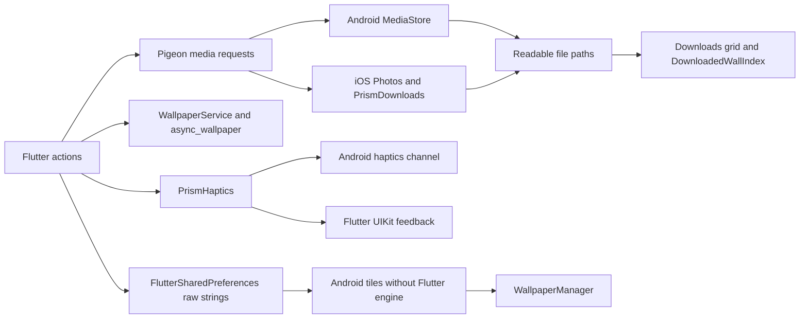

# Native audit

This audit starts at `076068442069a34d8bb9440e1e81989ddbb039ce` on 2026-10-01. Implementation and verification run in the existing worktree. The current architecture and accepted review findings are recorded below. Test results describe the tree at the time of each check; subsequent edits require affected checks again. The decision log is [native-audit-decisions.tsv](native-audit-decisions.tsv).

The user directed removal of the unneeded Codacy webhook integration. Codacy was never a required ruleset check. Webhook `269562294` was deleted and a subsequent hook listing contained no Codacy hook; the `master` and `v3` rulesets require only `ci`. Removing repository access from the app installation returned HTTP 403, so complete app-access revocation is not claimed. Absence of a new Codacy run on the next push remains to be checked. Actionable manual-code fixes remain in the PR and use the native gates.

## Code and dependency coverage

| Area | Files or dependency boundary | Finding and required proof |
| --- | --- | --- |
| Android media | `PrismMediaHostApiImpl.kt`, `PrismImageTransfer.kt`, `PrismImageValidation.kt`, `MainActivity.kt` | Bounded background work validates sources, filenames and actual image decoding. Pending MediaStore rows roll back on failure. A storage lock coordinates publication, inventory and deletion; engine detach resolves queued work. Eight app JVM checks, the full Android native gate, release R8 minification and final emulator media instrumentation passed. The final local gates postdate the device phase. Normal debug launch reached guest onboarding with a captured screenshot; no OAuth sign-in was performed. |
| Android tiles | `WallpaperTileService.kt`, `MyTileService.kt`, `WotdTileService.kt`, `FavsTileService.kt` | Shared transfer/application code retains the three manifest component names and raw preference keys. Main-thread tile state, repeat-tap deduplication, unlock, policy checks and teardown replace repeated service implementations. Unknown targets fail. Final emulator actions verified home, lock and both target IDs and rapid-tap deduplication; the category tile also completed a live provider request. |
| Android haptics | `PrismHaptics.kt`, `MainActivity.kt`, `lib/core/haptics/prism_haptics.dart` | Six public meanings use `prism/haptics`. Validate the channel argument and retain device support checks. Emulator proof cannot establish physical vibration quality. |
| Android configuration | Gradle settings, app and root scripts, wrapper, properties, manifest, ProGuard rules, resources | Toolchain worker owns compatibility research and updates. Keep Java 17, wallpaper permission, billing, notifications, app links, and scoped media ownership. Android 24 through 28 needs legacy storage permission requested only for user media actions. The release R8 minification task passed without signing or publishing; this is shrinking proof, not a signed release artifact. |
| iOS media | `PrismMediaHostApiImpl.swift`, `Runner/Media/PrismMediaFiles.swift`, `RunnerTests.swift`, `MediaFilesTests.swift` | A main-actor host and file actor replace blocking semaphores. Async transfers, ImageIO decoding, duplicate-safe staging and a host operation queue preserve completed-save replies and ordered download deletion. Sixteen tests across storage and host suites passed on the final simulator, including actual Photos import/completion/cleanup and queue/source-lifetime regressions. |
| iOS lifecycle | `AppDelegate.swift`, platform `FlutterSceneDelegate`, generated registrant | Pigeon registers through the implicit Flutter engine. Retain plugin registration, scene support, and the existing Flutter lifecycle. The normal debug app launched to home and opened expanded wallpaper details during the final simulator phase. |
| iOS configuration | `Podfile`, `Podfile.lock`, Xcode project, xcconfigs, plist, entitlements, storyboards, icons | iOS 15 support, Photos add permission, Sign in with Apple, app links and launch resources remain. Obsolete Firebase/RevenueCat source patches were removed after upstream comparison. The unsigned iOS build, simulator test build, sixteen runtime tests and normal app navigation passed. |
| Generated media bridge | `pigeons/prism_media_api.dart`, Dart, Kotlin, and Swift generated outputs | Retain the four typed methods. Regenerate all outputs together. Generated casts assume a matching Dart/native build. Validate actual request values in implementations. Do not hand-edit generated codecs. |
| Dart media consumers | `download_button.dart`, `ai_wallpaper_tab_page.dart`, `wallpaper_filter_screen.dart`, `first_wallpaper_service.dart`, `review_tile_parts.dart`, `download_screen.dart`, `settings_screen.dart` | URI classification replaces bundle-name substring matching. Native success still means a completed save, readable filesystem paths and safe edited-file lifetime. Focused tests and the integrated full local gate passed. Device navigation and the exact pushed-head gate remain separate. |
| Dart wallpaper and tiles | `wallpaper_service.dart`, `quick_tile_config_service.dart`, WOTD listener, `FavouriteQuickTileListener`, `main.dart` | File URI decoding, checked preference writes, strict source/target parsing and eager JSON casting harden the boundary. Favourites refresh after same-status edits and clear on logout/account changes. Native preference format remains unchanged. |
| Vendored Functions plugin | `packages/cloud_functions/android`, `ios`, `macos`, native examples and metadata | Validated arguments, cancellation-safe subscription handling, terminal stream handling and detach cleanup replace unsafe casts and subscription leaks. Android retains unbounded upstream demand via `Long.MAX_VALUE`; no bounded backpressure claim is made. Swift encoding distinguishes booleans from numeric NSNumber values; responses preserve signed Int64 and use Double for larger integers. Public Dart stream cancellation reaches its native delegate. Native examples and macOS remain compatibility code, not Prism runtime targets. |
| Flutter plugins with native code | Wallpaper, Firebase, notifications, RevenueCat, ads, sign-in, image picker/compression/editor, audio, display mode, quick actions, haptics, share, preferences, path provider, Sentry, Mixpanel, device/package info, URL launcher | Toolchain worker checks current stable releases and SDK constraints. Resolve from `pubspec.yaml` and verify `pubspec.lock`, Android dependency graph, and `Podfile.lock`. Native framework versions are transitive where plugin manifests own them. No claim that a version bump alone proves compatibility. |
| Existing native assets | Android icons, splash, tile drawables, themes, XML, iOS icons and storyboards | Retain product and launch assets. Remove a resource only when references and the built app establish that it is unused. No UI redesign is part of this audit. |

## Existing data path

Pigeon owns media transport. `async_wallpaper` owns interactive Android wallpaper application. Native tiles remain independent of a running Flutter engine. Sharing remains with `share_plus`. Prism has no custom SwiftUI screen to replace.

The Android implementation uses a shared image transfer and publish path. One storage lock coordinates completed MediaStore publication and clear operations. Transfers have a 100 MiB bound. Android 29 exposes a private cached file under an ID directory with its original basename.

The bounded Android media queue reports `MEDIA_BUSY` with a retry message when another ordinary submission exceeds its capacity. Executor closure remains a detached-engine failure. Explicit Flutter target platforms now select matching native ABI filters for non-split APKs; universal requests and split-per-ABI builds retain their existing architecture behavior. This removes unrequested ARM32/x86 libraries from an arm64-only artifact without weakening the size gate.

The iOS implementation uses a main-actor host and a file actor. Asynchronous downloads and Photos calls replace semaphores. ImageIO thumbnail decoding and UTType determine the stored extension. Downloads use hidden staged files, exclude them from inventory and choose a new ` (n)` name for duplicates. The host serializes enqueue, list and clear operations in call order. A public clear waits for an earlier save to finish, then removes its completed download; it does not cancel Photos work. The file actor alone permits hidden staging to survive a clear, which is an internal storage behavior rather than the public API ordering. The unsigned iOS build and final simulator run passed: sixteen tests covered storage, host queue, source lifetime and actual Photos import.

Subsequent review separated source resolution, download, image validation and normalization into small helpers while preserving rollback ownership. Network transfers retain a 30-second idle request timeout and now allow up to 600 seconds total for a progressing, size-bounded transfer. Photos filenames derive from the original URL basename and detected extension, omit query parameters, and fall back to `Prism` when the URL has no basename. A new storage regression covers this behavior; the earlier sixteen-test device run is separate from the affected local rerun.

## Selected toolchain versions

The toolchain worker checked the following release and compatibility sources on 2026-10-01. Build results remain a separate gate.

| Dependency | Selected version or rule | Source and constraint |
| --- | --- | --- |
| Kotlin, Gradle, and AGP | Kotlin 2.4.20, Gradle 9.7.0, AGP 9.3.1 | [Kotlin Gradle compatibility table](https://kotlinlang.org/docs/gradle-configure-project.html) supports this combination. Newer Gradle 9.8 and AGP 9.4.1 exceed that published matrix. |
| Latest Gradle reference | Latest compatible version selected above | [Gradle current release API](https://services.gradle.org/versions/current). |
| Latest AGP reference | Latest compatible version selected above | [Google Maven AGP metadata](https://dl.google.com/dl/android/maven2/com/android/tools/build/gradle/maven-metadata.xml). |
| Google Services Gradle plugin | 4.5.0 | [Google Maven metadata](https://dl.google.com/dl/android/maven2/com/google/gms/google-services/maven-metadata.xml). |
| Android desugaring | 2.1.5 | [Google Maven metadata](https://dl.google.com/dl/android/maven2/com/android/tools/desugar_jdk_libs/maven-metadata.xml). |
| Pigeon | 27.3.0 | [Pigeon package metadata](https://pub.dev/api/packages/pigeon). Latest 29.0.4 conflicts with the analyzer constraint used by the current Freezed generator. All three generated outputs remain coupled. |
| Firebase iOS | 12.19.0 through `firebase_core` 4.15.0 | [Firebase Core package metadata](https://pub.dev/api/packages/firebase_core) owns the SDK pin. Firebase 12.19.2 is newer but is not forced across FlutterFire. |
| Precompiled Firestore | Match `firebase_core` SDK | [Firestore binaries release 12.19.0](https://github.com/invertase/firestore-ios-sdk-frameworks/releases/tag/12.19.0). The Podfile now reads the version from Firebase Core. |
| RevenueCat | Flutter 10.14.0, hybrid common 19.5.0, iOS 5.92.0 | [Hybrid podspec](https://raw.githubusercontent.com/RevenueCat/purchases-hybrid-common/19.5.0/PurchasesHybridCommon.podspec). Keep plugin-owned native versions aligned. |
| Swift | Swift 6 language mode for app-owned code | Available Xcode 27 has Swift 6.4. Hosted native CI selects Xcode 26.6 on macOS 26. SwiftUI is a platform framework, and Prism has no custom SwiftUI implementation to migrate. Build proof is separate. |
| Android SDK | Compile SDK 37, target SDK 36, minimum SDK 24 | [Android 17 setup guidance](https://developer.android.com/about/versions/17/setup-sdk). Target 37 requires a separate Android 17 behavior migration and device proof; the final available emulator is API 36. |
| Path provider Android | 2.2.23 | Newer 2.3.1 requires JNI 1.x, conflicting with JNI 0.14.2 used by Sentry Flutter 9.30.1. The resolved lock preserves this compatibility boundary. |
| Google Mobile Ads | Flutter 9.0.0, iOS SDK 13.3.0 | The attempted 9.1.0 build failed on non-modular private beta headers. Retain the latest version that compiles with the current framework setup; do not disable module validation to accept the newer release. |
| Audio on Darwin | `audioplayers_darwin` 6.5.0 with Swift 5 language mode | Its upstream SwiftPM manifest uses tools 5.9 and Swift 5; its podspec omits a language version. A narrowly scoped Podfile setting prevents app Swift 6 mode from breaking this dependency. |
| Flutter native plugins | Stable versions compatible with the resolved Flutter SDK | `pubspec.yaml` and `pubspec.lock` record exact choices. [Pub package metadata](https://pub.dev/api/packages) supplies package release information. Native dependencies remain coupled to each plugin's manifest. |

The Podfile removes two source-rewrite patches after comparison with upstream fixes. The checked sources are [Firebase FunctionsContext at 12.19.0](https://raw.githubusercontent.com/firebase/firebase-ios-sdk/12.19.0/FirebaseFunctions/Sources/Internal/FunctionsContext.swift) and [RevenueCat PaywallColor at 5.92.0](https://raw.githubusercontent.com/RevenueCat/purchases-ios/5.92.0/Sources/Paywalls/PaywallColor.swift). Audio compatibility follows the [Darwin podspec](https://raw.githubusercontent.com/bluefireteam/audioplayers/main/packages/audioplayers_darwin/darwin/audioplayers_darwin.podspec) and [SwiftPM manifest](https://raw.githubusercontent.com/bluefireteam/audioplayers/main/packages/audioplayers_darwin/darwin/audioplayers_darwin/Package.swift). Ads evidence includes the [upstream beta header change](https://github.com/googleads/googleads-mobile-flutter/pull/1445) and the [official 9.0.0 package archive](https://pub.dev/api/archives/google_mobile_ads-9.0.0.tar.gz). Source comparison and dependency resolution remain separate from the build results below.

## Bridge contracts

| Contract | Consumer evidence | Required behavior |
| --- | --- | --- |
| Completed success | `DownloadButton._performDownload`, AI `_save`, review `_download` | Success follows durable save. Analytics, coin-gate success, saved toast, and completion callbacks run after the native result. Queue acceptance is insufficient. |
| Temporary image lifetime | `WallpaperFilterScreen._handleDownloadAction` | Dart deletes the edited file in `finally` after the reply. Native code must consume the file and finish the save before replying. |
| Readable download paths | `DownloadScreen.readData` and `FileImage` | Each item is a usable filesystem path. `content://` is not a usable substitute in the current API. |
| Wallpaper attribution | `DownloadedWallIndex.resolve` | Preserve the requested basename. The index recognizes exact names and duplicate suffixes such as ` (1)`. Android cache paths named only by MediaStore ID lose attribution. |
| Media authenticity | `SaveMediaRequest`, `DownloadRequest` | Validate image bytes, URL scheme, redirect target, local file, and filename at the native boundary. A nonempty HTTP response is not enough. Extension and MIME type must describe saved bytes. |
| Scoped deletion | Settings clear-downloads dialog and cache maintenance | Delete Prism download entries. Keep Photos library assets and unrelated files. Cache clearing must preserve saved downloads. Coordinate deletion with in-flight transfers. |
| Completion and disposal | Generated host handlers and engine registration | Complete each request once on the required callback thread. Dispose executors and unregister handlers with the engine. Do not lose a pending reply during cleanup. |
| Tile preferences | `PersistenceKeys`, `QuickTileConfigService`, tile services | Read `FlutterSharedPreferences` keys prefixed with `flutter.quick_tile.`. Values are plain strings and JSON, not `StoreValueCodec` payloads. Preserve `home`, `lock`, `both`, `pexels`, and `wallhaven` meanings. |
| Haptic meanings | `PrismHaptics` and `test/core/haptics/prism_haptics_test.dart` | Preserve selection, tap, impact, success, warning, and error. Disabled feedback makes no call. Unknown channel data must not silently become a tap. |

Generated Pigeon decoders use force casts and array indexing before the implementation receives a request. Their safety comes from the matching generated client, not from native URL validation. Codec regeneration and round-trip checks address that dependency. The channel is an in-process Flutter bridge, not a public network API.

## API choice

| Choice | Consequence | Audit conclusion |
| --- | --- | --- |
| Retain typed media requests and use internal native enums/errors | Existing callers and channel mocks remain valid. Source validation and haptic parsing have one native owner. | Selected. This meets current consumer requirements without changing transport. |
| Add a new Pigeon haptic API and redesign every bridge result | Changes the Pigeon schema, all generated languages, haptic dispatch, and many widget-test mocks. | No current consumer requires this migration. Reconsider when an actual new contract requires it. |

## Reproduction and verification coverage

Independent contract review accepted and verified these fixes against the current source:

- Android image validation now decodes sampled pixels. Header-only bounds validation had accepted a PNG header with a corrupt body. Device instrumentation contains matching-length corrupt-body and corrupt-local-file regressions.
- Android instrumentation owns rows by UUID basename and unique fixture bytes. Cleanup no longer deletes every new MediaStore row on a shared emulator.
- Stored tile source/target values fail explicitly, and favourite JSON is materialized inside the loader's error boundary. This prevents silent both-screen application and delayed cast failures.
- The public callable stream no longer wraps its delegate in `asBroadcastStream`. That wrapper retained the underlying subscription after a consumer cancelled. A regression fails before the fix and passes afterward.
- Native stream cancellation now removes a registered channel only when the cancelling handler is still its current owner. A delayed cancellation from a replaced handler cannot unregister the replacement. Kotlin has a regression for channel replacement; the Swift iOS/macOS implementations retain the same identity guard.
- Swift response decoding keeps exact signed Int64 values and represents larger integers as Double. An NSNumber wrapping UInt64.max crosses Flutter's signed integer codec as `-1`; the revised boundary check requires a positive Double wire representation.
- Public iOS download clear waits behind earlier saves. The final simulator host regressions passed for download-then-clear callback order, Photos failure rollback and eventual owner release.
- The final Photos test exposed error 3302 when importing valid PNG bytes from a `.tmp` URL despite an explicit content-type hint. Resolved image files now use their detected extension: remote temporary files move to a typed URL, while mislabelled local files copy to an owned temporary URL so the caller's original survives. Photos receives the normalized original filename. The final platform regression uses one `.tmp` image with unique random fixture pixels and deletes only date-bounded, UUID-owned assets. An earlier identical-byte control caused Photos deduplication to reuse metadata; unique bytes remove that test ambiguity. Actual import, reply ordering and scoped cleanup passed on the final simulator run.

Completed checks before master integration:

| Check | Result and evidence | Remaining scope |
| --- | --- | --- |
| `make ci` | Exit 0; 1186 Flutter tests passed. `/tmp/prism-native-audit/make-ci-final.log`. | Historical pre-integration run; the later integrated 1200-test pass below supersedes it. |
| Android app JVM tests | Seven tests, zero failures/errors. `build/app/test-results/testDebugUnitTest/TEST-com.hash.prism.PrismNativeTest.xml`. | Historical initial result; the later full native gate and emulator instrumentation below supersede it. |
| Functions JVM tests | Seven tests, zero failures/errors. `build/cloud_functions/test-results/testDebugUnitTest/TEST-io.flutter.plugins.firebase.functions.FunctionsNativeTest.xml`; `/tmp/prism-native-audit/functions-jvm-tests.log`. | Historical seven-test result; the later integrated run adds an eighth Functions test. |
| Callable cancellation regression | One test passed after the fix, with scoped analysis reporting no issues. `/tmp/prism-native-audit/callable-stream-cancel-after.log`; `/tmp/prism-native-audit/callable-stream-analyze.log`. | Native server/provider behavior is not covered by this delegate-level regression. |
| `make native-ios-check` | Exit 0; eight Swift storage tests, standalone Swift codec/argument check and unsigned `Runner.app` build passed. `/tmp/prism-native-audit/ios-check-ads-compatible.log`. | Historical pre-integration compile result; the later gate adds simulator build-for-testing. Host/Photos runtime remains separately tracked. |

Earlier failed attempts remain in the log directory. The two standalone Swift storage logs predate the fix for `/var` versus `/private/var` test path comparisons; later eight-test passes supersede them. The iOS audio and 9.1.0 ads failures informed the explicit compatibility choices above. The later full native Android gate below supersedes the earlier lint failures.

Completed checks after master integration, based on `31cdeb66` and the subsequent working-tree test/Photos fixes:

| Check | Result and evidence | Remaining scope |
| --- | --- | --- |
| `make ci` | Exit 0; 1200 Flutter tests passed, with one existing GPU-dependent skip. `/tmp/prism-native-audit/make-ci-integrated-final.log`. | The later native-only test/Photos fixes and final pushed head need appropriate checks. |
| `make native-android-check` after final review | Exit 0; debug APK built; eight app and nine Functions JVM tests passed with no failures, errors or skips; lint passed. `/tmp/prism-native-audit/android-check-final-review.log` and JVM XML reports supersede `android-final-native-check.log`. Tests include the busy-result mapping and stale-handler cancellation regressions. | The final local source/compile gate postdates the earlier device phase. Hosted CI on the final pushed commit is separate. |
| `:app:assembleDebugAndroidTest` after final review | Exit 0. `/tmp/prism-native-audit/android-instrumentation-final-build.log` supersedes earlier instrumentation builds, including the cleanup-fix rebuild. | The earlier actual device run is recorded separately below; the final runner refactor was compile-checked without another device run. |
| `:app:minifyReleaseWithR8` | Passed in 2m 26s. `/tmp/prism-native-audit/android-release-r8.log`; `/tmp/prism-native-audit/android-release-r8-dryrun.log` confirms no signing/publish task in the selected scope. | A signed release and store upload were not requested or performed. The transitive Amazon SDK 3.0.5 stackmap warning did not become a missing-class error. |
| iOS native gate after final review | Exit 0; ten storage tests, standalone Swift 6 codec/argument check, unsigned device `Runner.app` and simulator build-for-testing passed. `/tmp/prism-native-audit/ios-check-final-review.log` supersedes the earlier Photos/remediation gates. This compiles the resolver extraction, URL filenames, resource timeout and vendored cancellation/SwiftPM changes. | The final local source/compile gate postdates the earlier device phase; the runtime row below describes that earlier executed tree. |
| iOS simulator runtime | Exit 0; sixteen tests in two suites passed, including real Photos import of mislabelled PNG, completion ordering, owned-asset deletion, queue ordering, injected denial rollback and local source lifetime. `/tmp/prism-native-audit/device-evidence/ios-native-tests-verified.log` and `ios-native-tests-verified.xcresult`. | This simulator runtime pass predates the later helper, timeout, URL-name and identity-guard review fixes. Those changes passed the affected local gates without another device phase. OAuth, purchases and social writes were not exercised. |
| Cloud Functions local gate | Node 24 dependency install and TypeScript build passed; 220 Node tests passed with zero failures, cancellations or skips. `/tmp/prism-native-audit/functions-install-node24.log`, `functions-build-node24.log`, `functions-tests-node24-ci.log`. | These are local server regression checks, not deployed provider behavior. |
| Web local gate | Dependency install, `npx tsc --noEmit` and the Next.js production build passed. `/tmp/prism-native-audit/web-install-node24.log`, `web-typecheck-node24.log`, `web-build.log`. | No web deployment was performed. |
| Firestore rules | Fifteen access-rule scenarios passed under the Firestore Emulator, including server-owned premium/coin protections. `/tmp/prism-native-audit/firestore-rules-test.log`. | Emulator authorization proof is separate from deployed rules. |
| Arm64 profile size | Build and unchanged size comparison passed against the exact hosted baseline: 65,795,653 B to 67,241,118 B, delta 1,445,465 B (1.38 MiB, 2.20%). The ZIP contains only `arm64-v8a` native libraries. `/tmp/prism-native-audit/android-size-fixed/report.md`, `report.json`, `app-profile.apk`; build log `android-size-fixed-build.log`. | The limits remain 1.5 MiB and 5%; hosted execution on the next pushed head is separate. |
| Vendored Functions SwiftPM graph | iOS and macOS dependency resolution passed with actual cached Firebase Core 4.15.0 packages and the Flutter SDK-generated local framework package. Both pin Firebase iOS SDK 12.19.0 and resolve local `firebase_core`/`FlutterFramework`, matching the official plugin graph. `/tmp/prism-native-audit/functions-spm-ios-resolve.log`, `functions-spm-macos-resolve.log`, `functions-spm-ios-graph.json`. | This proves manifest/graph resolution, not an independent SwiftPM app runtime. Latest native compile/test reruns cover the modified source separately. |

The single reserved final device phase is complete and predates the later review fixes documented above. Its Android emulator results are:

| Scenario | Observed result | Evidence |
| --- | --- | --- |
| Native media instrumentation | Final runner reported `Prism native media checks passed`. It covers local save, HTTP fixture downloads, readable inventory, MIME preservation, duplicate saves, malformed filename/source rejection, corrupt/truncated payload rollback and scoped clear. Cleanup was corrected to tolerate its own downloads already removed by clear. | `/tmp/prism-native-audit/device-evidence/android-native-tests-final.log` |
| Home-only tile | Explicit system/lock baseline IDs `6/4` changed to `7/4`; the independent lock wallpaper remained. | `device-evidence/android-wallpaper-before.txt`, `device-evidence/android-wallpaper-home.txt` |
| Lock-only tile | IDs `7/4` changed to `7/8`; the system wallpaper remained. | `device-evidence/android-wallpaper-lock.txt` |
| Both-screen category tile | A live provider request succeeded. System ID became `9` with `mWhich=3`; no separate lock state remained, consistent with both screens sharing the new system image. | `device-evidence/android-wallpaper-category.txt` |
| Five rapid taps | One subsequent application produced system ID `10` with `mWhich=3`. | `device-evidence/android-wallpaper-repeated.txt`, `device-evidence/android-tiles-repeated.xml` |

Device evidence paths in the table are under `/tmp/prism-native-audit`. Android screenshots include `device-evidence/android-tiles.png` and `device-evidence/android-wallpaper-applied.png`. The initial `SKIP_FIREBASE_INIT=true` app launch encountered the baseline dependency-injection redbox. A normal debug build subsequently reached guest onboarding, independently checked in `device-evidence/android-guest.png` and `device-evidence/android-guest.xml`. No OAuth sign-in was performed. This establishes normal launch/onboarding, while native media and tile behavior are proven by their separate platform results.

The verification contract below defines what each proof layer establishes; completed results are recorded above:

| Check | Evidence required |
| --- | --- |
| Native image handling | Valid JPEG, PNG, and supported other formats. Incorrect content type, corrupt bytes, truncated response, redirect, unsupported scheme, missing local file, and filename traversal return failures without leftover published files. |
| Save lifecycle | A delayed save does not block the calling thread. Main-thread completion occurs once. Photo permission refusal returns failure. Filter temporary files remain usable until save completion. |
| Download inventory | Save two copies, list usable paths, resolve original attribution, clear, and list empty. Verify cache clear retains downloads and a failed save leaves no download. |
| Tile boundaries | Test targets, malformed stored strings and JSON, empty favourites, missing API key, repeated taps, service teardown, HTTP failure, and settings write refusal. Main-thread tile state returns inactive after success and failure. |
| Functions native bridge | Unary scalar/container encoding, Firebase exception mapping, terminal streaming error, cancellation, empty response, and detach cleanup. Tests that only mock Dart do not prove native behavior. |
| Local gates | `make ci`, focused Flutter native-consumer tests, vendored plugin tests, Android unit tests, Android debug/release builds, and iOS compile checks. Record the exact command, commit or tree, exit status, and log path. |
| Generated outputs | Run `make pigeon-gen` twice and verify the second run introduces no diff. Do not treat generated output compilation as a native behavior test. |
| Final device session | Completed one final phase using the iOS Simulator and Android emulator, including runtime regression reruns for failures found within that phase. Screenshots and logs are recorded above and below. |
| PR gates | Review the exact diff, push the verified commit, open the PR, and inspect hosted CI and required checks on that head. Local passes, hosted passes, and device behavior remain separate evidence. |

The normal Firebase-enabled iOS debug build launched to home, opened a wallpaper and expanded its details. Screenshots are `device-evidence/ios-home.png` and `device-evidence/ios-detail.png`; `device-evidence/ios-detail-tree.txt` confirms the visible metadata and Download/Favourite/Share/Edit controls. No OAuth sign-in, purchase or social write was performed. Media save/failure/clear behavior is established by native regression execution; the screenshots establish navigation rather than every Flutter media action. Android was restored from its initial snapshot and its fixtures cleaned after testing. iOS cleanup is being finalized.

Hosted checks on the final PR head remain pending. API 24–28 storage permissions and physical haptic quality cannot be established by an API 36 emulator. The category tile completed a live provider request; WOTD/favourite fixture actions separately exercise deterministic image transfer and target application. The orchestrator verifies hosted checks on the pushed head; local and device results do not substitute for that gate.
